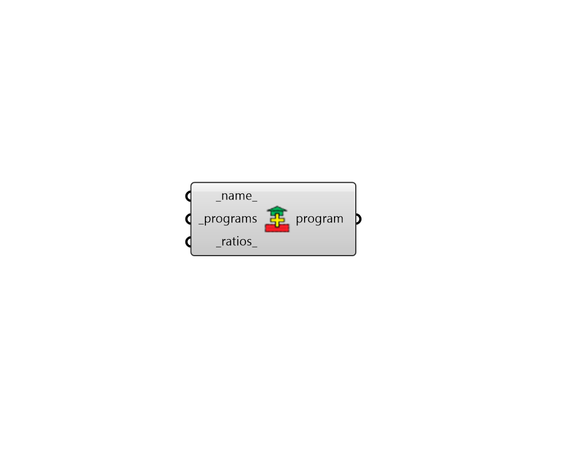

# Blend ProgramTypes

 - [\[source code\]](https://github.com/ladybug-tools/honeybee-grasshopper-energy/blob/master/honeybee_grasshopper_energy/src//HB%20Blend%20ProgramTypes.py)

Create a ProgramType object by blending other ProgramTypes together using a weighted average based on program ratios.

## Inputs

* **name**

  Text to set the name for the ProgramType and to be incorporated into a unique ProgramType identifier. 

* **programs \[Required\]**

  A list of ProgramType objects that will be averaged together to make a new ProgramType. 

* **ratios**

  A list of fractional numbers with the same length as the input programs that sum to 1. These will be used to weight each of the ProgramType objects in the resulting average. If None, the input program objects will be weighted equally. Default: None. 

## Outputs

* **program**

  A ProgramType object that's a weighted average between the input \_programs. 

