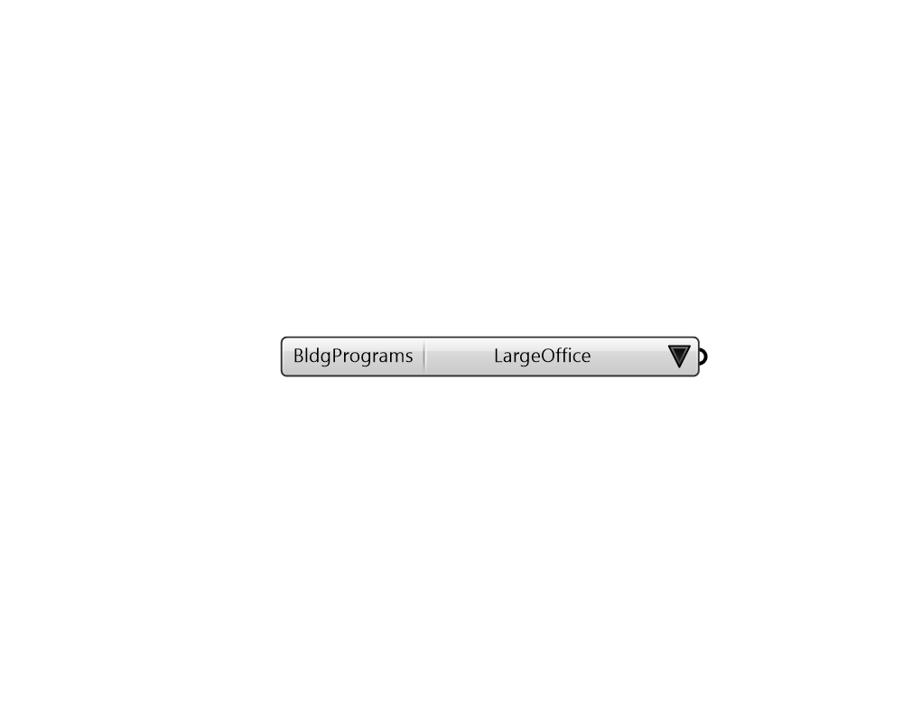

# Building Programs

 - [\[source code\]](https://github.com/ladybug-tools/honeybee-grasshopper-energy/blob/master/honeybee_grasshopper_energy/src//HB%20Building%20Programs.py)

Provides a list of available building programs in the ProgramType library.

