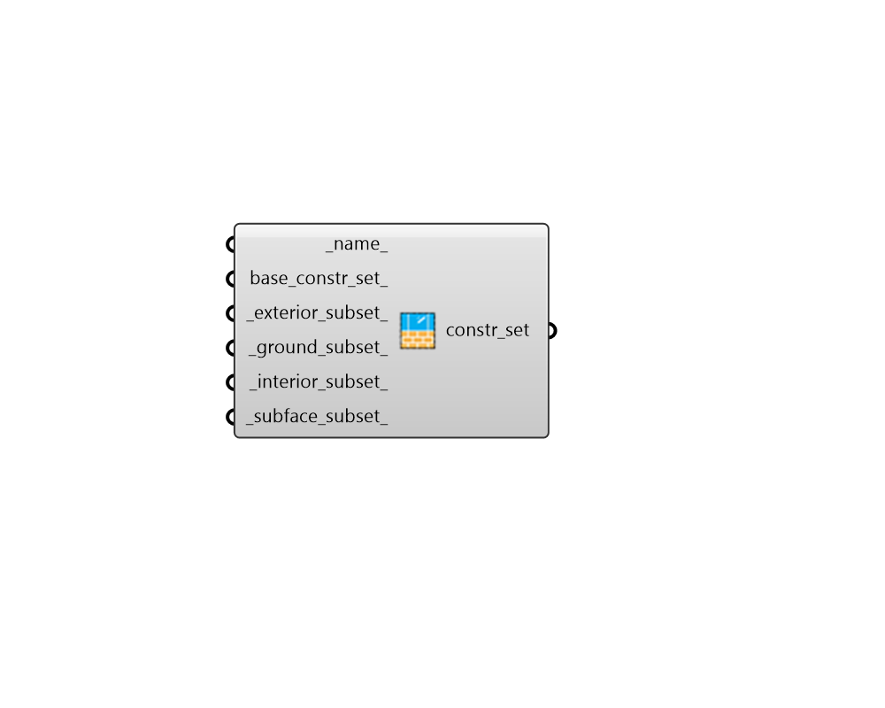

# ConstructionSet

 - [\[source code\]](https://github.com/ladybug-tools/honeybee-grasshopper-energy/blob/master/honeybee_grasshopper_energy/src//HB%20ConstructionSet.py)

Create a ConstructionSet object containing all energy constructions needed to create an energy model. ConstructionSets can be assigned to Honeybee Rooms to specify all default constructions on the Room.

## Inputs

* **name**

  Text to set the name for the ConstructionSet and to be incorporated into a unique ConstructionSet identifier. 

* **base\_constr\_set**

  An optional ConstructionSet object that will be used as the starting point for the new ConstructionSet output from this component. This can also be text for the name of a ConstructionSet within the library such as that output from the "HB Search Construction Sets" component. If None, the Honeybee "Generic Default Construction Set" will be used as the base. 

* **exterior\_subset**

  A construction subset list from the "HB Exterior Construction Subset" component. Note that None values in this list correspond to no change to the given construction in the base_constr\_set_. 

* **ground\_subset**

  A construction subset list from the "HB Ground Construction Subset" component. Note that None values in this list correspond to no change to the given construction in the base_constr\_set_. 

* **interior\_subset**

  A construction subset list from the "HB Interior Construction Subset" component. Note that None values in this list correspond to no change to the given construction in the base_constr\_set_. 

* **subface\_subset**

  A construction subset list from the "HB Subface Subset" component. Note that None values in this list correspond to no change to the given construction in the base_constr\_set_. 

## Outputs

* **constr\_set**

  A ConstructionSet object that can be assigned to Honeybee Rooms in order to specify all default constructions on the Room. 

