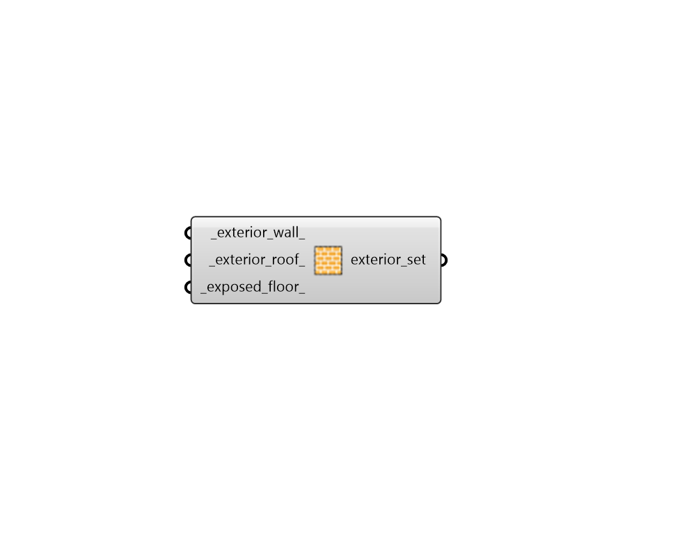

# Exterior Construction Subset

 - [\[source code\]](https://github.com/ladybug-tools/honeybee-grasshopper-energy/blob/master/honeybee_grasshopper_energy/src//HB%20Exterior%20Construction%20Subset.py)

Create a list of exterior constructions that can be used to edit or create a ConstructionSet object.

## Inputs

* **exterior\_wall**

  A construction object for exterior walls \(or text for the identifier of the construction within the library\). 

* **exterior\_roof**

  A construction object for exterior roofs \(or text for the identifier of the construction within the library\). 

* **exposed\_floor**

  A construction object for exposed floors \(or text for the identifier of the construction within the library\). 

## Outputs

* **exterior\_set**

  A list of exterior constructions that can be used to edit or create a ConstructionSet object. 

