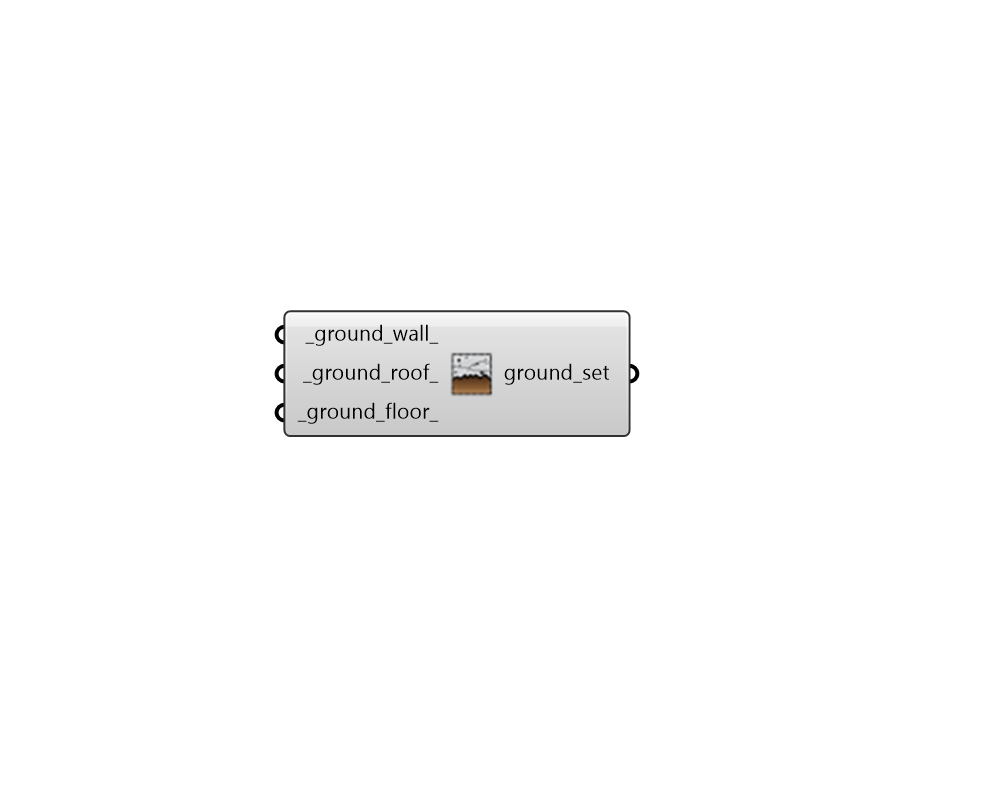

# Ground Construction Subset

 - [\[source code\]](https://github.com/ladybug-tools/honeybee-grasshopper-energy/blob/master/honeybee_grasshopper_energy/src//HB%20Ground%20Construction%20Subset.py)

Create a list of ground constructions that can be used to edit or create a ConstructionSet object.

## Inputs

* **ground\_wall**

  A construction object for underground walls \(or text for the identifier of the construction within the library\). 

* **ground\_roof**

  A construction object for underground roofs \(or text for the identifier of the construction within the library\). 

* **ground\_floor**

  A construction object for ground-contact floors \(or text for the identifier of the construction within the library\). 

## Outputs

* **ground\_set**

  A list of ground constructions that can be used to edit or create a ConstructionSet object. 

