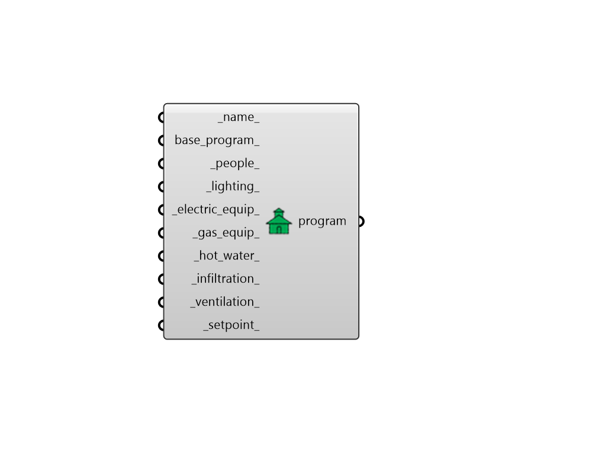

# ProgramType

 - [\[source code\]](https://github.com/ladybug-tools/honeybee-grasshopper-energy/blob/master/honeybee_grasshopper_energy/src//HB%20ProgramType.py)

Create a ProgramType object possessing all schedules and loads defining the usage of a space.

ProgramTypes can be assigned to Honeybee Rooms to specify all default schedules and loads on the Room.

## Inputs

* **name**

  Text to set the name for the ProgramType and to be incorporated into a unique ProgramType identifier. 

* **base\_program**

  An optional ProgramType object that will be used as the starting point for the new ProgramType output from this component. This can also be text for the name of a ProgramType within the library such as that output from the "HB Search Program Types" component. If None, a Plenum program type will be used as the base with no loads, setpoints, or ventilation requirements assigned. 

* **people**

  A People object to describe the occupancy of the program. If None, no occupancy will be assumed for the program. \(Default: None\). 

* **lighting**

  A Lighting object to describe the lighting usage of the program. If None, no lighting will be assumed for the program. \(Default: None\). 

* **electric\_equip**

  An ElectricEquipment object to describe the usage of electric equipment within the program. If None, no electric equipment will be assumed for the program. \(Default: None\). 

* **gas\_equip**

  A GasEquipment object to describe the usage of gas equipment within the program. If None, no gas equipment will be assumed for the program. \(Default: None\). 

* **hot\_water**

  A ServiceHotWater object to describe the usage of hot water within the program. If None, no hot water will be assumed for the program. \(Default: None\). 

* **infiltration**

  An Infiltration object to describe the outdoor air leakage of the program. If None, no infiltration will be assumed for the program. \(Default: None\). 

* **ventilation**

  A Ventilation object to describe the minimum outdoor air requirement of the program. If None, no ventilation requirement will be assumed for the program. \(Default: None\). 

* **setpoint**

  A Setpoint object to describe the temperature and humidity setpoints of the program.  If None, the ProgramType cannot be assigned to a Room that is conditioned. \(Default: None\). 

## Outputs

* **program**

  A ProgramType object that can be assigned to Honeybee Rooms in order to specify all default schedules and loads on the Room. 

