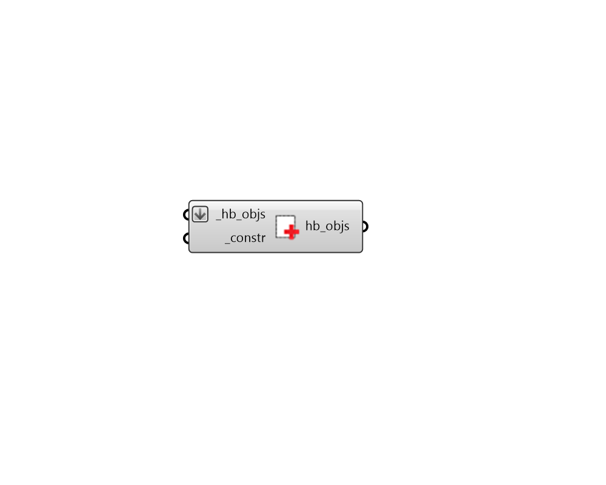

# Apply Shade Construction

 - [\[source code\]](https://github.com/ladybug-tools/honeybee-grasshopper-energy/blob/master/honeybee_grasshopper_energy/src//HB%20Apply%20Shade%20Construction.py)

Apply a ShadeConstruction to Honeybee Shade objects. Alternatively, it can assign a ShadeConstruction to all of the child shades of an Aperture, Door, Face, or a Room.

This component supports the assigning of different constructions based on cardinal orientation, provided that a list of ShadeConstructions are input to the \_constr.

## Inputs

* **hb\_objs \[Required\]**

  Honeybee Shades, Apertures, Doors, Faces, or Rooms to which the input \_constr should be assigned. For the case of a Honeybee Aperture, Door, Face or Room, the ShadeConstruction will be assigned to only the child shades directly assigned to that object. So passing in a Room will not change the construction of shades assigned to Apertures of the Room's Faces. If this is the desired outcome, then the Room should be deconstructed into its child objects before using this component. 

* **constr \[Required\]**

  A Honeybee ShadeConstruction to be applied to the input \_hb\_objs. This can also be text for a construction to be looked up in the shade construction library. If an array of text or construction objects are input here, different constructions will be assigned based on cardinal direction, starting with north and moving clockwise. 

## Outputs

* **hb\_objs**

  The input honeybee objects with their constructions edited. 

