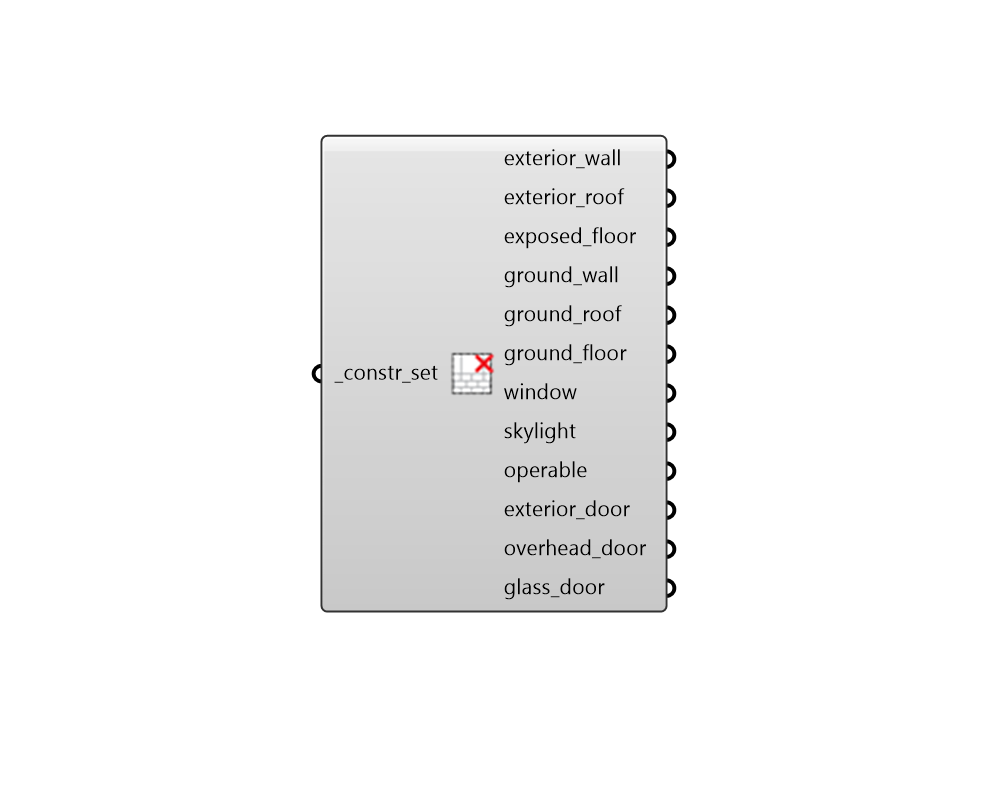

# Deconstruct ConstructionSet

 - [\[source code\]](https://github.com/ladybug-tools/honeybee-grasshopper-energy/blob/master/honeybee_grasshopper_energy/src//HB%20Deconstruct%20ConstructionSet.py)

Deconstruct a construction set into its constituient exterior constructions.

## Inputs

* **constr\_set \[Required\]**

  A construction set to be deconstructed. This can also be text for a construction set to be looked up in the construction set library. 

## Outputs

* **exterior\_wall**

  A construction object for the set's exterior walls. 

* **exterior\_roof**

  A construction object for the set's exterior roofs. 

* **exposed\_floor**

  A construction object for the set's exposed floors. 

* **ground\_wall**

  A construction object for the set's underground walls. 

* **ground\_roof**

  A construction object for the set's underground roofs. 

* **ground\_floor**

  A construction object for the set's ground-contact floors. 

* **window**

  A construction object for apertures with an Outdoors boundary condition and a Wall face type for their parent face. 

* **skylight**

  A construction object for apertures with an Outdoors boundary condition and a RoofCeiling or Floor face type for their parent face. 

* **operable**

  A construction object for apertures with an Outdoors boundary condition and True is\_operable property. 

* **exterior\_door**

  A construction object for opaque doors with an Outdoors boundary condition and a Wall face type for their parent face. 

* **overhead\_door**

  A construction object for opaque doors with an Outdoors boundary condition and a RoofCeiling or Floor face type for their parent face. 

* **glass\_door**

  A construction object for all glass doors with an Outdoors boundary condition. 

