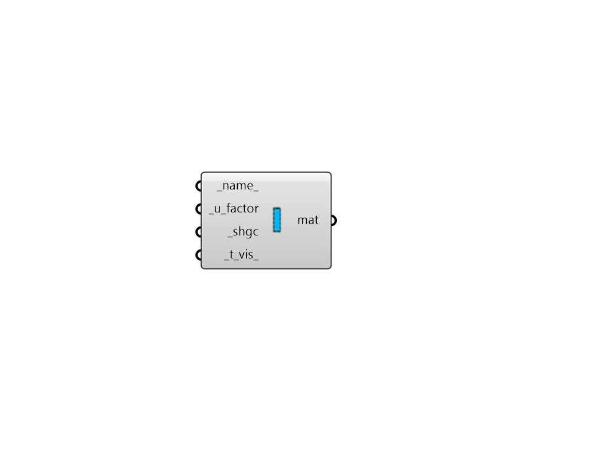

# Window Material

 - [\[source code\]](https://github.com/ladybug-tools/honeybee-grasshopper-energy/blob/master/honeybee_grasshopper_energy/src//HB%20Window%20Material.py)

Create a simple window material to describe an entire glazing system, including glass, gaps, and frame. This material can be plugged into the "HB Window Construction" component.

## Inputs

* **name**

  Text to set the name for the material and to be incorporated into a unique material identifier. 

* **u\_factor \[Required\]**

  A number for the U-factor of the glazing system \[W/m2-K\] including standard air gap resistances on either side of the glazing system. 

* **shgc \[Required\]**

  A number between 0 and 1 for the solar heat gain coefficient of the glazing system. This includes both directly transmitted solar heat as well as solar heat that is absorbed by the glazing system and conducts towards the interior. 

* **t\_vis**

  A number between 0 and 1 for the visible transmittance of the glazing system. \(Default: 0.6\). 

## Outputs

* **mat**

  A window material that describes an entire glazing system, including glass, gaps, and frame and can be assigned to a Honeybee Window construction. 

