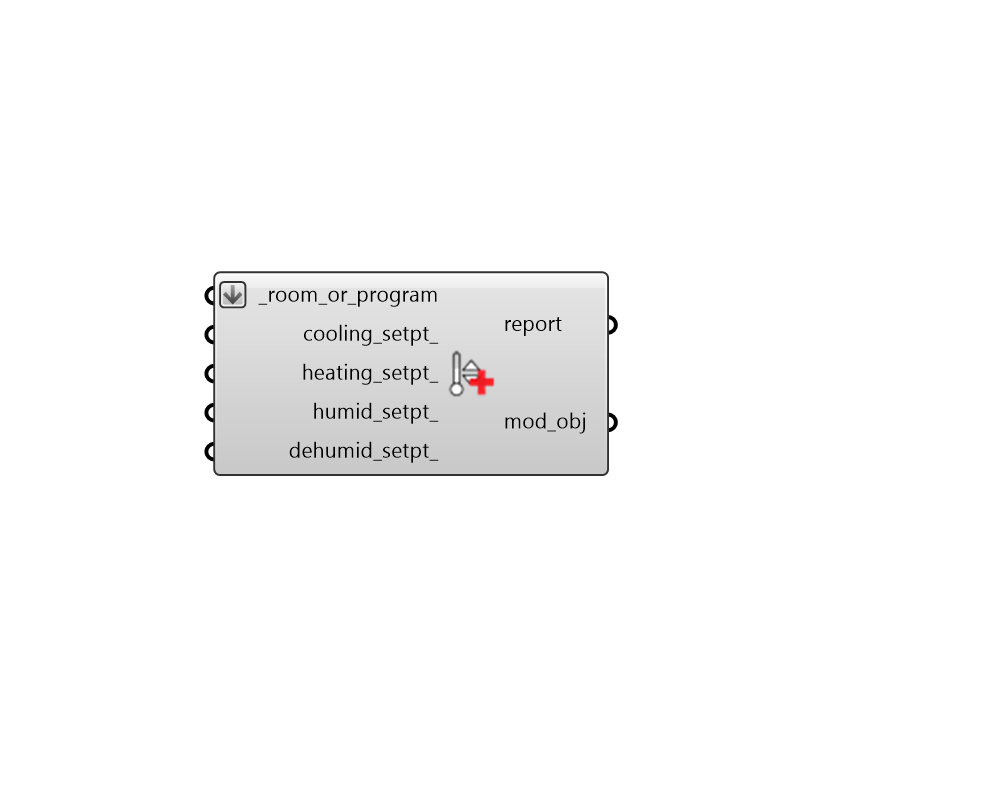

# Apply Setpoint Values

 - [\[source code\]](https://github.com/ladybug-tools/honeybee-grasshopper-energy/blob/master/honeybee_grasshopper_energy/src//HB%20Apply%20Setpoint%20Values.py)

Apply values for setpoints to a Room or ProgramType.

## Inputs

* **room\_or\_program \[Required\]**

  Honeybee Rooms or ProgramType objects to which the input setpoints should be assigned. This can also be the identifier of a ProgramType to be looked up in the program type library. 

* **cooling\_setpt**

  A numerical value for a single constant temperature for the cooling setpoint \[C\]. 

* **heating\_setpt**

  A numerical value for a single constant temperature for the heating setpoint \[C\]. 

* **humid\_setpt**

  A numerical value for a single constant value for the humidifying setpoint \[%\]. 

* **dehumid\_setpt**

  A numerical value for a single constant value for the dehumidifying setpoint \[%\]. 

## Outputs

* **report**

  Reports, errors, warnings, etc. 

* **mod\_obj**

  The input Rooms or ProgramTypes with their setpoint values edited. 

