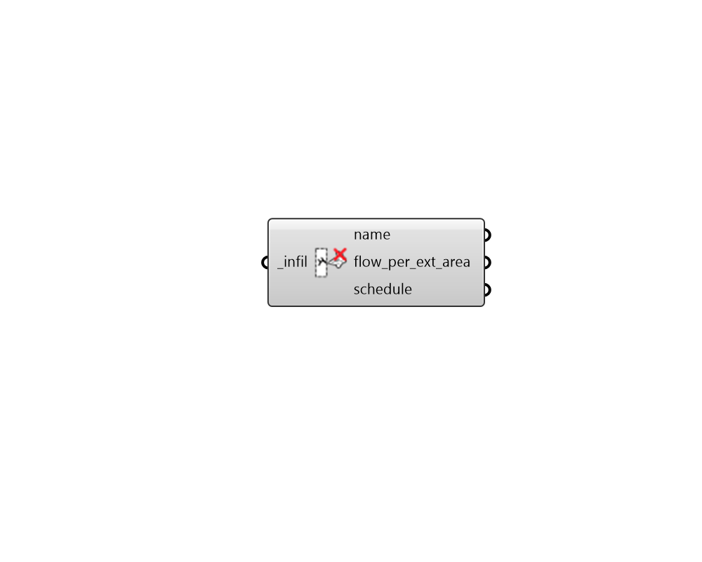

# Deconstruct Infiltration

 - [\[source code\]](https://github.com/ladybug-tools/honeybee-grasshopper-energy/blob/master/honeybee_grasshopper_energy/src//HB%20Deconstruct%20Infiltration.py)

Deconstruct an Infiltration object into its constituient properties.

## Inputs

* **infil \[Required\]**

  An Infiltration object to be deconstructed. 

## Outputs

* **name**

  Text string for the infiltration display name. 

* **flow\_per\_ext\_area**

  A numerical value for the intensity of infiltration in m3/s per square meter of exterior surface area. Typical values for this property are as follows \(note all values are at typical building pressures of ~4 Pa\):

  * 0.0001 \(m3/s per m2 facade\) - Tight building
  * 0.0003 \(m3/s per m2 facade\) - Average building
  * 0.0006 \(m3/s per m2 facade\) - Leaky building

* **schedule**

  A fractional schedule for the infiltration over the course of the year. The fractional values will get multiplied by the flow\_per\_exterior\_area to yield a complete infiltration profile. 

