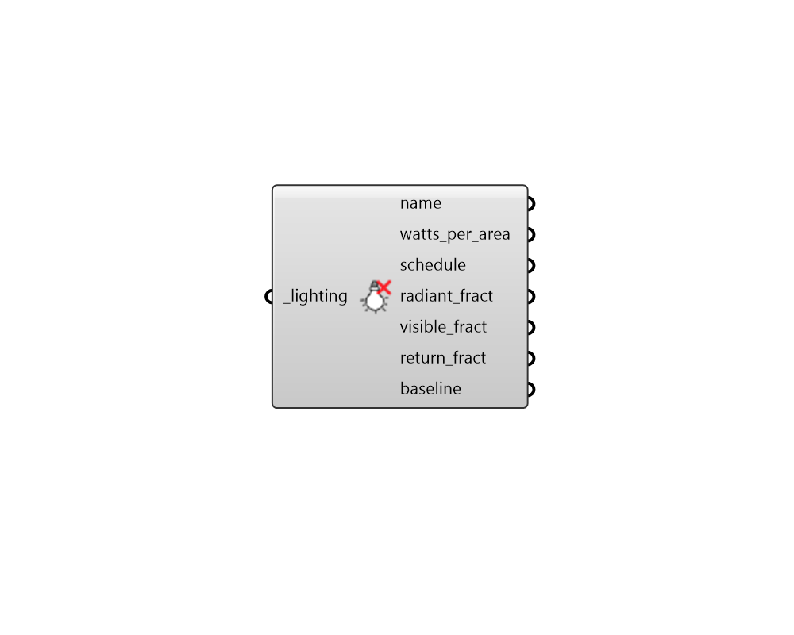

# Deconstruct Lighting

 - [\[source code\]](https://github.com/ladybug-tools/honeybee-grasshopper-energy/blob/master/honeybee_grasshopper_energy/src//HB%20Deconstruct%20Lighting.py)

Deconstruct a Lighting object into its constituient properties.

## Inputs

* **lighting \[Required\]**

  A Lighting object to be deconstructed. 

## Outputs

* **name**

  Text string for the lighting display name. 

* **watts\_per\_area**

  A numerical value for the lighting power density in Watts per square meter of floor area. 

* **schedule**

  A fractional for the use of lights over the course of the year. The fractional values will get multiplied by the watts\_per\_area to yield a complete lighting profile. 

* **radiant\_fract**

  A number between 0 and 1 for the fraction of the total lighting load given off as long wave radiant heat. 

* **visible\_fract**

  A number between 0 and 1 for the fraction of the total lighting load given off as short wave visible light. 

* **return\_fract**

  A number between 0 and 1 for the fraction of the total lighting load that goes into the zone return air. 

* **baseline**

  The baseline lighting power density in W/m2 of floor area. This baseline is useful to track how much better the installed lights are in comparison to a standard like ASHRAE 90.1. 

