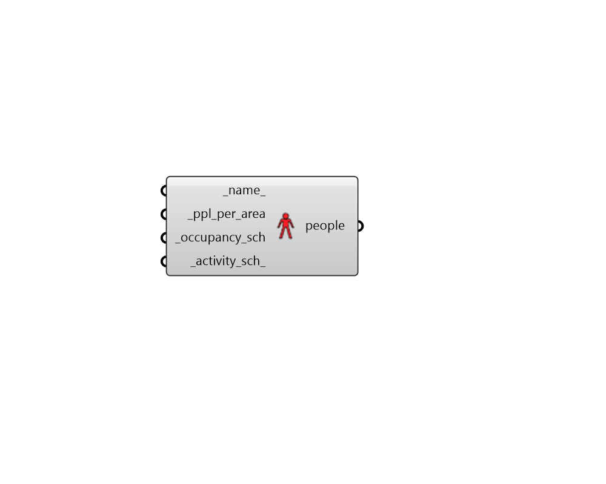

# People

 - [\[source code\]](https://github.com/ladybug-tools/honeybee-grasshopper-energy/blob/master/honeybee_grasshopper_energy/src//HB%20People.py)

Create a People object that can be used to create a ProgramType or be assigned directly to a Room.

## Inputs

* **name**

  Text to set the name for the People and to be incorporated into a unique People identifier. If None, a unique name will be generated. 

* **ppl\_per\_area \[Required\]**

  A numerical value for the number of people per square meter of floor area. 

* **occupancy\_sch \[Required\]**

  A fractional schedule for the occupancy over the course of the year. The fractional values in this schedule will get multiplied by the \_people\_per\_area to yield a complete occupancy profile. 

* **activity\_sch**

  A schedule for the activity of the occupants over the course of the year. The type limt of this schedule should be "Activity Level" and the values of the schedule equal to the number of Watts given off by an individual person in the room. If None, it will a default constant schedule with 120 Watts per person will be used, which is typical of awake, adult humans who are seated. 

## Outputs

* **people**

  A People object that can be used to create a ProgramType or be assigned directly to a Room. 

