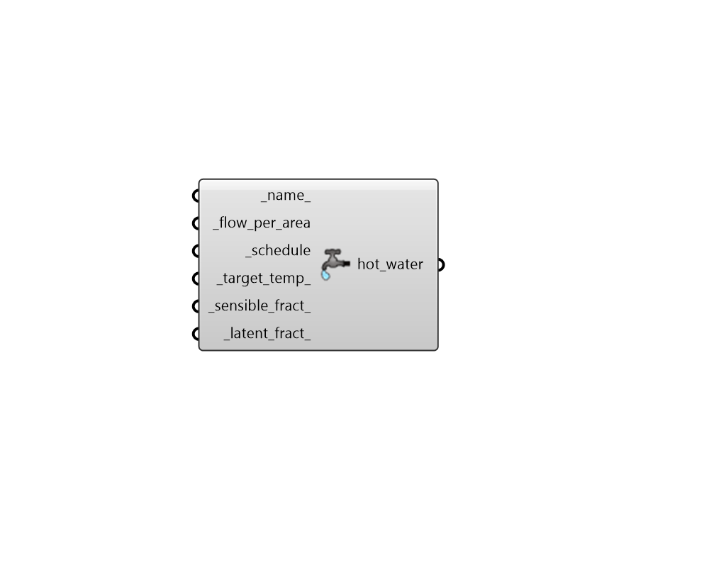

# Service Hot Water

 - [\[source code\]](https://github.com/ladybug-tools/honeybee-grasshopper-energy/blob/master/honeybee_grasshopper_energy/src//HB%20Service%20Hot%20Water.py)

Create an ServiceHotWater object that can be used to specify hot water usage in a ProgramType.

## Inputs

* **name**

  Text to set the name for the ServiceHotWater and to be incorporated into a unique ServiceHotWater identifier. If None, a unique name will be generated. 

* **flow\_per\_area \[Required\]**

  A numerical value for the total volume flow rate of water per unit area of floor \(L/h-m2\). 

* **schedule \[Required\]**

  A fractional schedule for the use of hot water over the course of the year. The fractional values will get multiplied by the \_flow\_per\_area to yield a complete water usage profile. 

* **target\_temp**

  The target temperature of the water out of the tap in Celsius. This the temperature after the hot water has been mixed with cold water from the water mains. The default value assumes that the flow\_per\_area on this object is only for water straight out of the water heater. \(Default: 60C\). 

* **sensible\_fract**

  A number between 0 and 1 for the fraction of the total hot water load given off as sensible heat in the zone. \(Default: 0.2\). 

* **latent\_fract**

  A number between 0 and 1 for the fraction of the total hot water load that is latent \(as opposed to sensible\). \(Default: 0.05\). 

## Outputs

* **hot\_water**

  A ServiceHotWater object that can be used to specify hot water usage in a ProgramType. 

