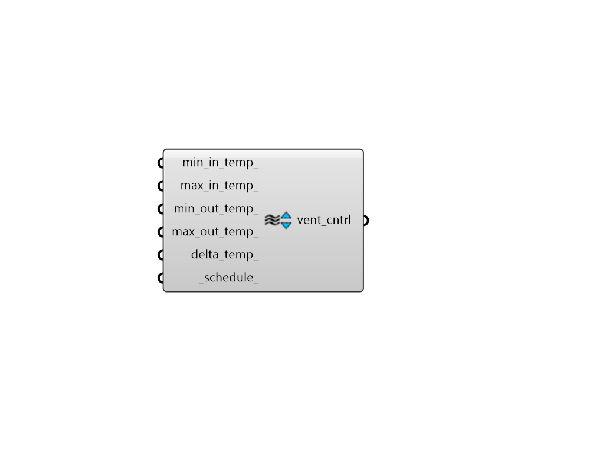

# Ventilation Control

 - [\[source code\]](https://github.com/ladybug-tools/honeybee-grasshopper-energy/blob/master/honeybee_grasshopper_energy/src//HB%20Ventilation%20Control.py)

Create a Ventilation Control object to dictate the temperature setpoints and schedule for ventilative cooling \(eg. opening windows\).

Note the all of the default setpoints of this object are set to always perform ventilative cooling such that one can individually decide which setpoints are relevant to a given ventilation strategy.

## Inputs

* **min\_in\_temp**

  A number between -100 and 100 for the minimum indoor temperature at which to ventilate in Celsius. Typically, this variable is used to initiate ventilation with values around room temperature above which the windows will open \(eg. 22 C\). \(Default: -100 C\). 

* **max\_in\_temp**

  A number between -100 and 100 for the maximum indoor temperature at which to ventilate in Celsius. This can be used to set a maximum temperature at which point ventilation is stopped and a cooling system is turned on. \(Default: 100 C\). 

* **min\_out\_temp**

  A number between -100 and 100 for the minimum outdoor temperature at which to ventilate in Celsius. This can be used to ensure ventilative cooling doesn't happen during the winter even if the Room is above the min\_in\_temp. \(Default: -100 C\). 

* **max\_out\_temp**

  A number between -100 and 100 for the maximum outdoor temperature at which to ventilate in Celsius. This can be used to set a limit for when it is considered too hot outside for ventilative cooling. \(Default: 100\). 

* **delta\_temp**

  A number between -100 and 100 for the temperature differential in Celsius between indoor and outdoor below which ventilation is shut off.  This should usually be a positive number so that ventilation only occurs when the outdoors is cooler than the indoors. Negative numbers indicate how much hotter the outdoors can be than the indoors before ventilation is stopped. \(Default: -100\). 

* **schedule**

  An optional schedule for the ventilation over the course of the year. This can also be the name of a schedule to be looked up in the standards library. Note that this is applied on top of any setpoints. The type of this schedule should be On/Off and values should be either 0 \(no possibility of ventilation\) or 1 \(ventilation possible\). \(Default: "Always On"\) 

## Outputs

* **vent\_cntrl**

  HBZones with their airflow modified. 

