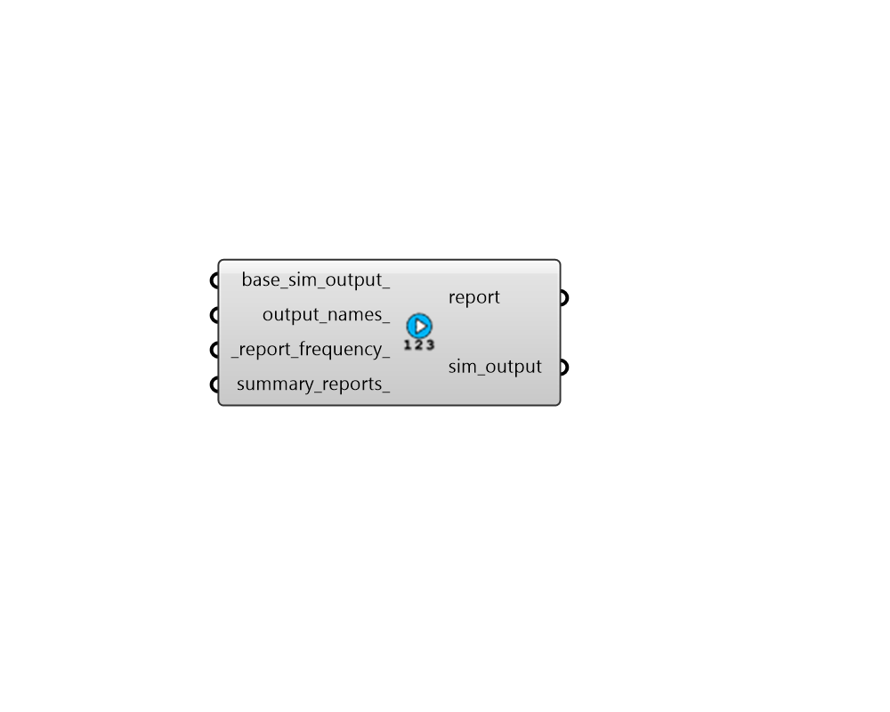

# Custom Simulation Output

 - [\[source code\]](https://github.com/ladybug-tools/honeybee-grasshopper-energy/blob/master/honeybee_grasshopper_energy/src//HB%20Custom%20Simulation%20Output.py)

Create a custom simulation output object by plugging in one or more names of EnergyPlus simulation ouputs. The resulting object can be used to request output variables from EnergyPlus.

## Inputs

* **base\_sim\_output**

  An optional simulation output object to serve as the starting point for the sim\_output object returned by this component. All of the output names will simply be appended to this initial starting object. 

* **output\_names**

  A list of EnergyPlus output names as strings \(eg. 'Surface Window System Solar Transmittance'. These outputs will be requested from the simulation. 

* **report\_frequency**

  Text for the frequency at which the outputs are reported. Default: 'Hourly'. Choose from the following:

  * Annual
  * Monthly
  * Daily
  * Hourly
  * Timestep

* **summary\_reports**

  An optional list of EnergyPlus summary report names as strings. If None, only the 'AllSummary' report will be requested from the simulation and will appear in the HTML report output by EnergyPlus. See the Input Output Reference SummaryReports section for a full list of all reports that can be requested. [https://bigladdersoftware.com/](https://bigladdersoftware.com/) epx/docs/9-1/input-output-reference/output-table-summaryreports.html 

## Outputs

* **report**

  Report! 

* **sim\_output**

  A SimulationOutput object that can be connected to the "HB Simulation Parameter" component in order to specify which types of outputs should be written from EnergyPlus. 

