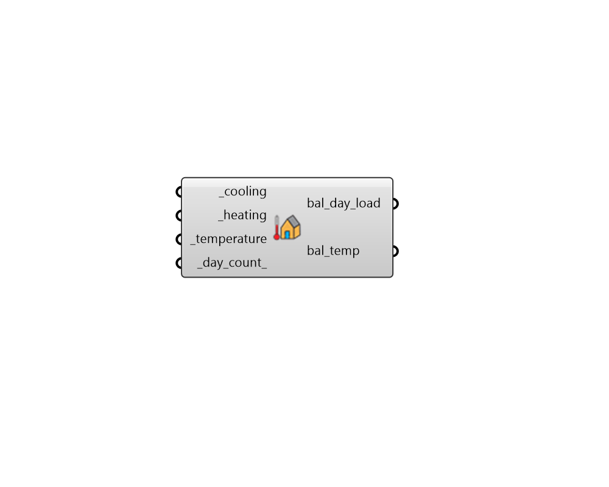

# Balance Temperature

 - [\[source code\]](https://github.com/ladybug-tools/honeybee-grasshopper-energy/blob/master/honeybee_grasshopper_energy/src//HB%20Balance%20Temperature.py)

Calculate a building \(or zone\) balance temperature from a ideal air load simulation results. The balance point is the outdoor temperature at which a building switches between heating and cooling.

If the outdoor temperture drops below the balance temperature, the building will usually be in heating mode and, if the outdoor temperture is above the balance temperature, the building will usually be in cooling mode.

The balance temperture concept is useful for setting things such as automated blinds and airflow schedules since having these things directly controlled by hourly cooling or heating demand isn't always straightforward.

This component works by taking the average combined heating/cooling values for each day and the average outdoor air temperature for each day. The days with the smallest combined heating + cooling will have their daily mean outdoor air tempertures averaged to produce the output balance temperture.

## Inputs

* **cooling \[Required\]**

  Data collection for the annual hourly or daily ideal air cooling load output from the "HB Read Room Energy Result" component.  This can be for a single room or the entire model. 

* **heating \[Required\]**

  Data collection for the annual hourly or daily ideal air heating load output from the "HB Read Room Energy Result" component.  This can be for a single room or the entire model. 

* **temperature \[Required\]**

  Data collection for the annual hourly or daily outdoor temperature. Most of the time, this should be the dry bulb temperature from the "LB Import EPW" component. However other types of temperature like sky temperature may improve accuracy since they include the effects of solar gain. Note that, whatever type of temperature is plugged in here determines the type of balance temperature that is output. 

* **day\_count**

  An integer for the number of days with a low thermal energy load that will be averaged together to yield the balance point. The use of multiple days is done to help avoid anomalies introduced by things like variations between weekday and weekend shcedules. It is recommended that this be increased for models with particularly high variation in schedules. \(Default: 10\). 

## Outputs

* **bal\_day\_load**

  The average thermal load on the balance day. This number should be close to 0 if the balance temperature is accurate and this output is meant to give a sense of the accuracy of the balance temperature value. 

* **bal\_temp**

  The outdoor balance temperature. 

