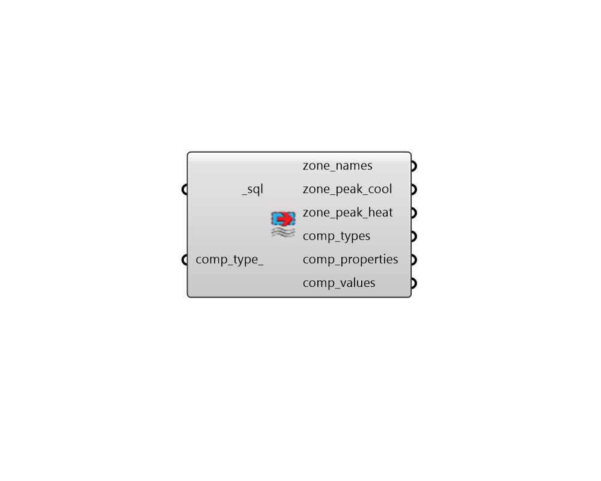

# Read HVAC Sizing

 - [\[source code\]](https://github.com/ladybug-tools/honeybee-grasshopper-energy/blob/master/honeybee_grasshopper_energy/src//HB%20Read%20HVAC%20Sizing.py)

Parse the peak load and HVAC component sizes from an SQL result file that has been generated from an energy simulation.

## Inputs

* **sql \[Required\]**

  The file path of the SQL result file that has been generated from an energy simulation. 

* **comp\_type**

  An optional name of a HVAC component type, which will filter the HVAC components that appear in the output comp\_props and comp\_values. Connecting nothing here will mean that all HVAC component sizes are imported and a full list of possible components will appear in the comp\_types output. 

## Outputs

* **zone\_names**

  A list of zone names \(honeybee Room identifiers\) that correspond to the zone\_peak\_load and zone\_peak\_heat below. 

* **zone\_peak\_cool**

  A list of numbers for the peak cooling load of each zone on the summer design day. These correspond to the zone\_names above. 

* **zone\_peak\_heat**

  A list of numbers for the peak heating load of each zone on the winter design day. These correspond to the zone\_names above. 

* **comp\_types**

  A list of HVAC component types that are available in the results. This will be equal to the input comp_type_ if a value is connected. 

* **comp\_properties**

  A list of text descriptions for HVAC component properties. These correspond to the comp\_values below. 

* **comp\_values**

  Values denoting the size of various zone HVAC components  \(eg. zone terminal sizes, boiler/chiller sizes, lengths of chilled beams, etc.\). These correspond to the comp\_properties above. 

