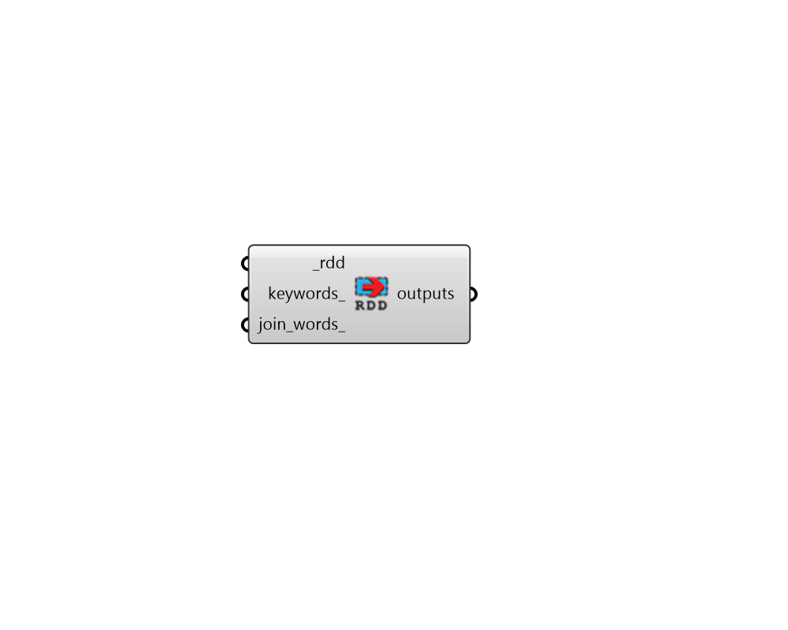

# Read Result Dictionary

 - [\[source code\]](https://github.com/ladybug-tools/honeybee-grasshopper-energy/blob/master/honeybee_grasshopper_energy/src//HB%20Read%20Result%20Dictionary.py)

Parse an .rdd file from an energy simulation to show all possible outputs that can be requested from the simulation.

## Inputs

* **rdd \[Required\]**

  Full path to a RDD file that was generated by EnergyPlus. 

* **keywords**

  An optional list of keywords that will be used to filter the output names. 

* **join\_words**

  If False or None, this component will automatically split any strings of multiple keywords \(spearated by spaces\) into separate keywords for searching. This results in a greater liklihood of finding an item in the search but it may not be appropropriate for all cases. You may want to set it to True when you are searching for a specific phrase that includes spaces. \(Default: False\). 

## Outputs

* **outputs**

  A list of EnergyPlus output names as strings \(eg. 'Surface Window System Solar Transmittance'\). If no keywords are input, this will be a list of all possible outputs that can be requested from the simulation. Outputs can be requested from the simulation by plugging them into the output_names_ of the "HB Custom Simulation Output" component. 

