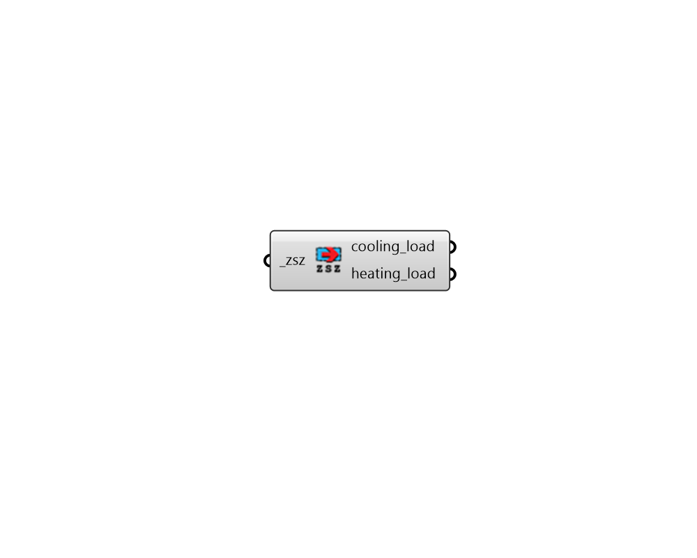

# Read Zone Sizing

 - [\[source code\]](https://github.com/ladybug-tools/honeybee-grasshopper-energy/blob/master/honeybee_grasshopper_energy/src//HB%20Read%20Zone%20Sizing.py)

Parse a zone sizing \(ZSZ\) csv result file from an energy simulation to get data collections for the cooling/heating load over the peak design day.

## Inputs

* **zsz \[Required\]**

  Full path to a zone sizing \(ZSZ\) csv result file that was generated by EnergyPlus. 

## Outputs

* **cooling\_load**

  a list of HourlyContinuousCollections for zone cooling load. There will be one data collection per conditioned zone in the model. 

* **heating\_load**

  a list of HourlyContinuousCollections for zone heating load. There will be one data collection per conditioned zone in the model. 

