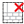

#### Component list:
*  [Search Constructions](../components/Search_Constructions.md)
*  [Search Materials](../components/Search_Materials.md)
*  [Deconstruct Construction](../components/Deconstruct_Construction.md)
*  [Deconstruct ConstructionSet](../components/Deconstruct_ConstructionSet.md)
*  [Deconstruct ConstructionSet Interior](../components/Deconstruct_ConstructionSet_Interior.md)
*  [Deconstruct Material](../components/Deconstruct_Material.md)
*  [Apply ConstructionSet](../components/Apply_ConstructionSet.md)
*  [Apply Opaque Construction](../components/Apply_Opaque_Construction.md)
*  [Apply Shade Construction](../components/Apply_Shade_Construction.md)
*  [Apply Window Construction](../components/Apply_Window_Construction.md)
*  [Opaque Construction](../components/Opaque_Construction.md)
*  [Shade Construction](../components/Shade_Construction.md)
*  [Window Construction](../components/Window_Construction.md)
*  [Window Construction Shade](../components/Window_Construction_Shade.md)
*  [Opaque Material](../components/Opaque_Material.md)
*  [Opaque Material No Mass](../components/Opaque_Material_No_Mass.md)
*  [Glass Material](../components/Glass_Material.md)
*  [Shade Material](../components/Shade_Material.md)
*  [Window Frame](../components/Window_Frame.md)
*  [Window Material](../components/Window_Material.md)
*  [Blind Material](../components/Blind_Material.md)
*  [Custom Window Gap Material](../components/Custom_Window_Gap_Material.md)
*  [Vegetation Material](../components/Vegetation_Material.md)
*  [Window Construction Dynamic](../components/Window_Construction_Dynamic.md)
*  [Window Gap Material](../components/Window_Gap_Material.md)