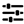

#### Component list:
*  [Gene Pool to Day Schedule](../components/Gene_Pool_to_Day_Schedule.md)
*  [Search Schedules](../components/Search_Schedules.md)
*  [Deconstruct Schedule](../components/Deconstruct_Schedule.md)
*  [Schedule to Data](../components/Schedule_to_Data.md)
*  [Apply Room Schedules](../components/Apply_Room_Schedules.md)
*  [Apply Shade Schedule](../components/Apply_Shade_Schedule.md)
*  [Constant Schedule](../components/Constant_Schedule.md)
*  [Fixed Interval Schedule](../components/Fixed_Interval_Schedule.md)
*  [Seasonal Schedule](../components/Seasonal_Schedule.md)
*  [Weekly Schedule](../components/Weekly_Schedule.md)
*  [Type Limit](../components/Type_Limit.md)