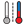
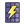

#### Component list:
*  [IdealAir](../components/IdealAir.md)
*  [Set Conditioned](../components/Set_Conditioned.md)
*  [All-Air HVAC](../components/All-Air_HVAC.md)
*  [All-Air HVAC Templates](../components/All-Air_HVAC_Templates.md)
*  [DOAS HVAC](../components/DOAS_HVAC.md)
*  [DOAS HVAC Templates](../components/DOAS_HVAC_Templates.md)
*  [HeatCool HVAC](../components/HeatCool_HVAC.md)
*  [HeatCool HVAC Templates](../components/HeatCool_HVAC_Templates.md)
*  [SHW System](../components/SHW_System.md)
*  [SHW Templates](../components/SHW_Templates.md)
*  [Electric Load Center](../components/Electric_Load_Center.md)
*  [Photovoltaic Properties](../components/Photovoltaic_Properties.md)
*  [Detailed HVAC](../components/Detailed_HVAC.md)
*  [Radiant HVAC Properties](../components/Radiant_HVAC_Properties.md)