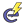

#### Component list:
*  [Model to OSM](../components/Model_to_OSM.md)
*  [Annual Loads](../components/Annual_Loads.md)
*  [Generation Loads](../components/Generation_Loads.md)
*  [Load Shade Benefit](../components/Load_Shade_Benefit.md)
*  [Peak Loads](../components/Peak_Loads.md)
*  [Custom Simulation Output](../components/Custom_Simulation_Output.md)
*  [Shadow Calculation](../components/Shadow_Calculation.md)
*  [Simulation Control](../components/Simulation_Control.md)
*  [Simulation Output](../components/Simulation_Output.md)
*  [Simulation Parameter](../components/Simulation_Parameter.md)
*  [Sizing Parameter](../components/Sizing_Parameter.md)
*  [Load Measure](../components/Load_Measure.md)
*  [Run OSW](../components/Run_OSW.md)
*  [Run IDF](../components/Run_IDF.md)
*  [Run OSM](../components/Run_OSM.md)
*  [Create OSM Measure](../components/Create_OSM_Measure.md)
*  [Empty OSM](../components/Empty_OSM.md)