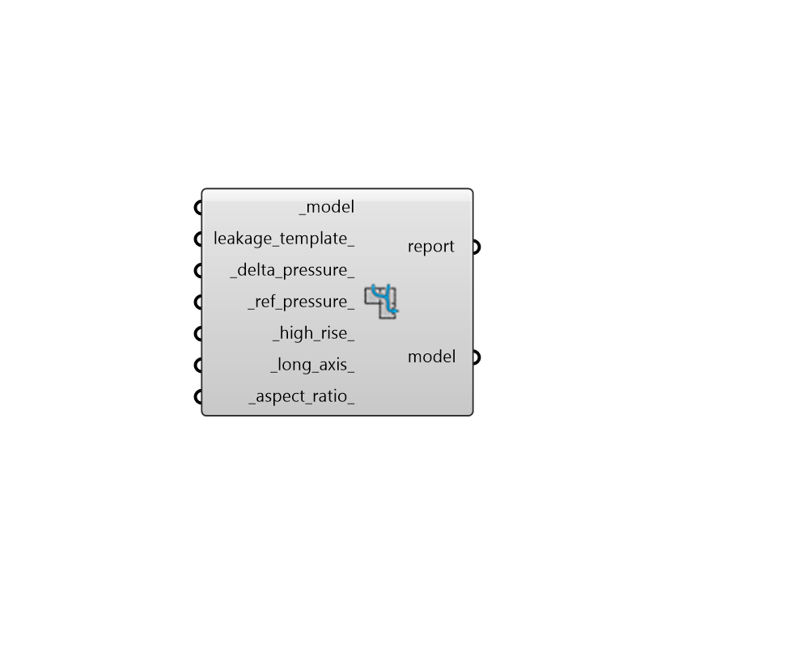

## Airflow Newtwork

 - [[source code]](https://github.com/ladybug-tools/honeybee-grasshopper-energy/blob/master/honeybee_grasshopper_energy/src//HB%20Airflow%20Newtwork.py)

Set up a Honeybee Model to use the EnergyPlus Airflow Network (AFN) for all airflow in the energy simulation. 

Compared to the default single-zone methods that Honeybee uses for infiltration and ventilation, the AFN represents air flow in a manner that is truer to the fluid dynamic behavior of real buildings. In particular, the AFN more accurately models the flow of air from one zone to another, accounting for the pressure changes induced by wind and air density differences. However, using the AFN means that the simulation will take considerably longer to run compared to the single zone option and the difference in simuation resuts is only likely to be significant when the Model contains operable windows or the building is extremely leaky. 

Passing a Honeybee Model through this component before energy simulation will result in the following changes to the EnergyPlus IDF: 

1. All ZoneInfiltration objects will be excluded and, instead, infitration will be modeled with AFN Crack objects assigned to each opaque Face. 

2. For all AirBoundary Faces within the Model, ZoneMixing objects will be excluded and, instead, the air boundary will be modeled with AFN Crack objects that have very large pressure coefficients derived from the orifice equation and the area of the air wall. 

3. For all operable Apertures, ZoneVentilation:WindandStackOpenArea objects will be excluded and, instead, these opearable apertures will be modeled with AFN SimpleOpening objects. 

4. For each Room with a VentilationControl object to specify setpoints at which the windows open, an Energy Management System (EMS) program will be written to dictate when the operable Apertures of the Room open. 

#### Inputs
* ##### model [Required]
A Honeybee Model for which the Airflow network will be set up. This Model should have everything assigned to it that is needed for simulation, including solved adjacencies and relevant window- opening properties. 
* ##### leakage_template 
Text identifying the leakiness of the Model, which is used to generate AFNCrack objects that represent infiltration for each of the Model's surfaces (Face, Aperture, and Door). 
Choose from the following. 

    * Excellent

    * Medium

    * VeryPoor
These three text values correspond to DesignBuilder's Cracks Templates, which provide typical crack flow coefficients and exponents for different envelope tightness classifications. 
If None, the exterior airflow leakage parameters will be derived from the room infiltration rate specified in the room's energy properties, which are in units of m3/s per m2 of facade. This derivation from the Room's infiltration will compute air leakage parameters for exterior cracks that produce a total air flow rate equivalent to the room's infiltration rate at an envelope pressure difference of 4 Pa. This default derivation is not as complete of a representation of building ariflow dynamics as the DesignBuilder Crack Templates are. However, since the airflow leakae parameters are derived from values in m3/s-m2 of infiltration, they are easier to relate to the results of infiltration blower-door tests, which typically express infiltration rates in these units. 
* ##### delta_pressure 
The air pressure difference across the building envelope in Pascals, which is used to calculate infiltration crack flow coefficients when no leakage tempate is specified. The resulting average simulated air pressure difference will roughly equal this delta pressure times the nth root of the ratio between the simulated and target room infiltration rates. (Default: 4). 
* ##### ref_pressure 
The reference barometric pressure measurement in Pascals under which the surface crack data were obtained. (Default: 101325). 
* ##### high_rise 
Booling indicating whether the Model is LowRise or HighRise. This parameter is used to estimate building-wide wind pressure coefficients for the AFN by approximating the building geometry as an extruded rectangle. LowRise corresponds to a building where the height is less then three times the width AND length of the footprint. HighRise corresponds to a building where height is more than three times the width OR length of the footprint. If None, this property will be auto-calculated from Room geometry of the Model. This default assumption may not be appropriate if the Model represents only a portion of a larger Building. 
* ##### long_axis 
A number between 0 and 180 for the clockwise angle difference in degrees that the long axis of the building is from true North. This parameter is used to estimate building-wide wind pressure coefficients for the AFN by approximating the building geometry as an extruded rectangle. 0 indicates a North-South long axis while 90 indicates an East-West long axis. If None, this property will be auto-calculated from Room geometry of the Model (either 0 or 90). This default assumption may not be appropriate if the Model represents only a portion of a larger Building. 
* ##### aspect_ratio 
A number between 0 and 1 for the aspect ratio of the building's footprint, defined as the ratio of length of the short axis divided by the length of the long axis. This parameter is used to estimate building-wide wind pressure coefficients for the AFN by approximating the building geometry as an extruded rectangle If None, this property will be auto-calculated from Room geometry of the Model and the _long_axis_ above. This default assumption may not be appropriate if the Model represents only a portion of a larger building. 

#### Outputs
* ##### report
... 
* ##### model
The input Honeybee Model for which the Airflow network has been set up. 