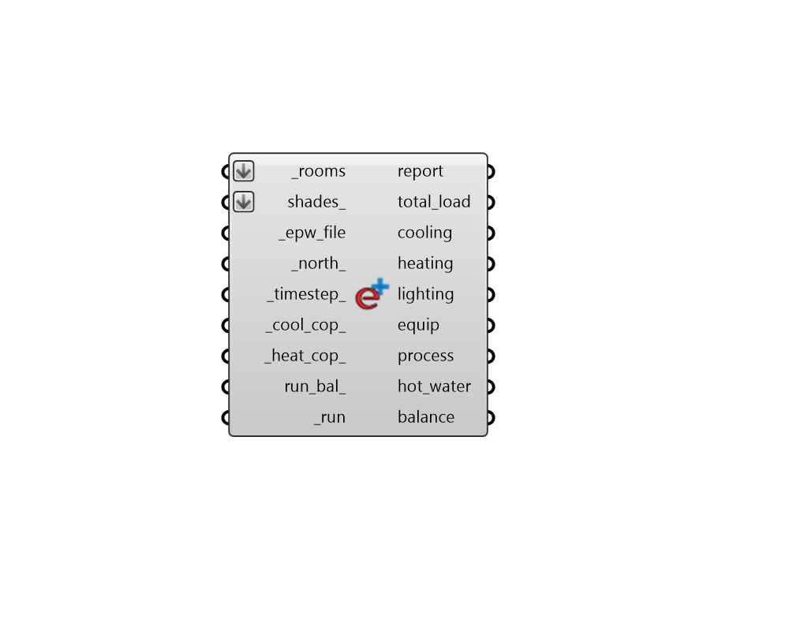

## Annual Loads

 - [[source code]](https://github.com/ladybug-tools/honeybee-grasshopper-energy/blob/master/honeybee_grasshopper_energy/src//HB%20Annual%20Loads.py)

Run Honeybee Rooms through a quick energy simulation to obtain an estimate of annual heating, cooling, lighting, equipment, and service hot water loads. 

Note that the default settings used by this component are only suitable for evaluating annual loads in the case where an error of up to 5% is acceptable. Also note that annual loads are not the same as annual energy use or utility costs and, while the "cop" inputs can be used to approximate some effects of real heating + cooling systems, any evaluation of actual energy use, utility costs, or GHG emissions should be done by modeling a detailed HVAC using the "HB Model to OSM" component. 

#### Inputs
* ##### rooms [Required]
A list of Honeybee Rooms for which annual loads will be computed. 
* ##### shades 
An optional list of Honeybee Shades that can block the sun to the input _rooms. 
* ##### epw_file [Required]
Path to an .epw file on your system as a text string. 
* ##### north 
A number between -360 and 360 for the counterclockwise difference between the North and the positive Y-axis in degrees. 90 is West and 270 is East. (Default: 0). 
* ##### timestep 
An integer for the number of timesteps per hour at which the energy balance calculation will be run. This has a dramatic impact on the speed of the simulation and the accuracy of results. Higher timesteps lead to longer simulations and more accurate results. At the lowest acceptable timestep of 1, the results can have an error up to 5% but increasing the timestep to 4 should drop errors to below 1%. (Default: 1). The following values are acceptable: (1, 2, 3, 4, 5, 6, 10, 12, 15, 20, 30, 60) 
* ##### cool_cop 
An optional number which the cooling load will be divided by to account for the relative importance of cooling loads compared to heating loads (aka. the Coefficient of Performance or COP). For most cooling systems, this is value greater than 1, though how much greater varies widely between cooling systems and it is ultimately a function of how close the temperature of the cooling system's heat sink is to the room temperature setpoints. If set to 1, the output cooling will be the energy that must be removed from the _rooms to meet the setpoint (aka. the cooling demand). (Default: 1). 
* ##### heat_cop 
An optional number which the heating load will be divided by to account for the relative importance of heating loads compared to cooling loads (aka. the Coefficient of Performance or COP). For fuel-based systems like gas boilers, this value tends to be less than 1 in order to represent the efficiency of the boiler and account for losses of heat, such as that through flue gases. For certain electric systems like heat pumps, this can be a value greater than 1 as such pumps may be able to pump more heat energy into a room per unit of electricity consumed. If set to 1, the output will be the energy that must be added to the _rooms to meet the setpoint (aka. the heating demand). (Default: 1). 
* ##### run_bal 
Set to True to have the full load balance computed after the simulation is run. This ensures that data collections for various terms of the load balance are output from the "balance". This can help explain why the loads are what they are but can also increase the component run time. (Default: False). 
* ##### run [Required]
Set to "True" to run the simulation to obtain annual loads. This can also be the integer 2 to run the simulation while being able to see the simulation process (with a batch window). 

#### Outputs
* ##### report
A report of the energy simulation run. 
* ##### total_load
A list of numbers for the 4-5 output load terms normalized by the floor area of the input _rooms. Units are kWh/m2. They are ordered as follows. 

    * cooling

    * heating

    * lighting

    * electric equipment

    * gas equipment (if the input rooms have it)

    * process load (if the input rooms have it)

    * service hot water (if the input rooms have it)
* ##### cooling
A monthly Data Collection for the cooling load intensity in kWh/m2. 
* ##### heating
A monthly Data Collection for the heating load intensity in kWh/m2. 
* ##### lighting
A monthly Data Collection for the lighting load intensity in kWh/m2. 
* ##### equip
A monthly Data Collection for the equipment load intensity in kWh/m2. Typically, this is only the load from electric equipment but, if the attached _rooms have gas equipment, this will be a list of two data collections for electric and gas equipment respectively. 
* ##### process
A monthly Data Collection for the process load intensity in kWh/m2. 
* ##### hot_water
A monthly Data Collection for the service hot water load intensity in kWh/m2. 
* ##### balance
A list of monthly data collections for the various terms of the floor-normalized load balance in kWh/m2. Will be None unless run_bal_ is set to True. 