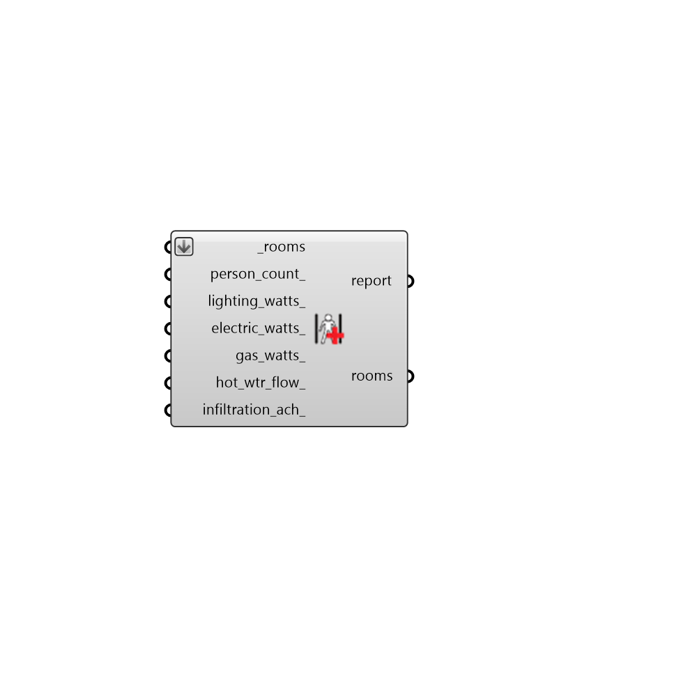

## Apply Abolute Load Values

 - [[source code]](https://github.com/ladybug-tools/honeybee-grasshopper-energy/blob/master/honeybee_grasshopper_energy/src//HB%20Apply%20Abolute%20Load%20Values.py)

Apply abolute load values to Rooms. 

Note that, while the assigned load values are abolute, this component will convert them to the "normalized" value for each room (eg. lighting per floor area) in order to apply them to the rooms. So, if a room has no floors or exterior walls, load values will be equal to 0 regardless of the input here. 

This component will not edit any of the schedules or other properties associated with each load value. If no schedule currently exists to describe how the load varies over the simulation, the "Always On" schedule will be used as a default. 

#### Inputs
* ##### rooms [Required]
Honeybee Rooms to which the input load values should be assigned. 
* ##### person_count 
A number for the quantity of people in the room. 
* ##### lighting_watts 
A number for the installed wattage of lighting in the room. 
* ##### electric_watts 
A number for the installed wattage of electric equipment in the room. 
* ##### gas_watts 
A number for the installed wattage of gas equipment in the room. 
* ##### hot_wtr_flow 
Number for the peak flow rate of service hot water in the room in liters per hour (L/h). 
* ##### infiltration_ach 
A number for the infiltration flow rate in air changes per hour (ACH). 

#### Outputs
* ##### report
Reports, errors, warnings, etc. 
* ##### rooms
The input Rooms with their load values modified. 