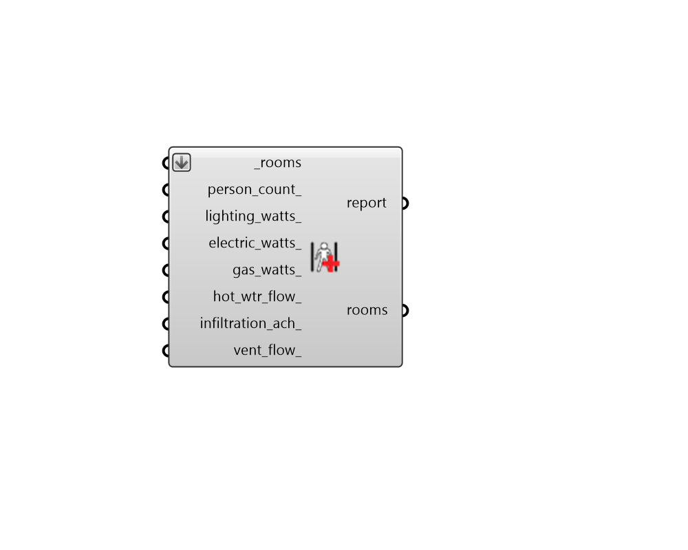

## Apply Absolute Load Values

 - [[source code]](https://github.com/ladybug-tools/honeybee-grasshopper-energy/blob/master/honeybee_grasshopper_energy/src//HB%20Apply%20Absolute%20Load%20Values.py)

Apply absolute load values to Rooms. 

Note that, while the assigned load values are absolute, this component will convert them to the "normalized" value for each room (eg. lighting per floor area) in order to apply them to the rooms. So any existing specification of load intensity is overwritten with the absolute load here. 

This also means that, if a room has no floors (or exterior walls for infiltration), the resulting load values will be equal to 0 regardless of the input here. The only exception is the vent_flow_, which will be applied regardless of the room properties. 

This component will not edit any of the schedules or other properties associated with each load value. If no schedule currently exists to describe how the load varies over the simulation, the "Always On" schedule will be used as a default. 

#### Inputs
* ##### rooms [Required]
Honeybee Rooms to which the input load values should be assigned. This can also be a Honeybee Model for which all Rooms will be assigned the loads. 
* ##### person_count 
A number for the quantity of people in the room. 
* ##### lighting_watts 
A number for the installed wattage of lighting in the room (W). 
* ##### electric_watts 
A number for the installed wattage of electric equipment in the room (W). 
* ##### gas_watts 
A number for the installed wattage of gas equipment in the room (W). 
* ##### hot_wtr_flow 
Number for the peak flow rate of service hot water in the room in liters per hour (L/h). 
* ##### infiltration_ach 
A number for the infiltration flow rate in air changes per hour (ACH). 
* ##### vent_flow 
A numerical value for the absolute of flow of outdoor air ventilation for the room in cubic meters per second (m3/s). Note that inputting a value here will overwrite all specification of outdoor air ventilation currently on the room (per_floor, per_person, ach). 

#### Outputs
* ##### report
Reports, errors, warnings, etc. 
* ##### rooms
The input Rooms with their load values modified. 