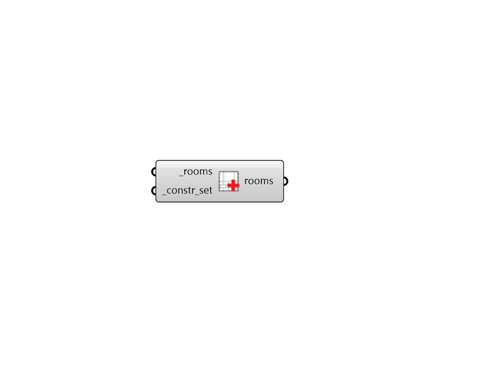

## Apply ConstructionSet

 - [[source code]](https://github.com/ladybug-tools/honeybee-grasshopper-energy/blob/master/honeybee_grasshopper_energy/src//HB%20Apply%20ConstructionSet.py)

Apply ConstructionSet to Honeybee Rooms. 

#### Inputs
* ##### rooms [Required]
Honeybee Rooms to which the input _constr_set should be assigned. 
* ##### constr_set [Required]
A Honeybee ConstructionSet to be applied to the input _room. This can also be text for a construction set to be looked up in the construction set library. 

#### Outputs
* ##### rooms
The input Rooms with their construction sets edited. 