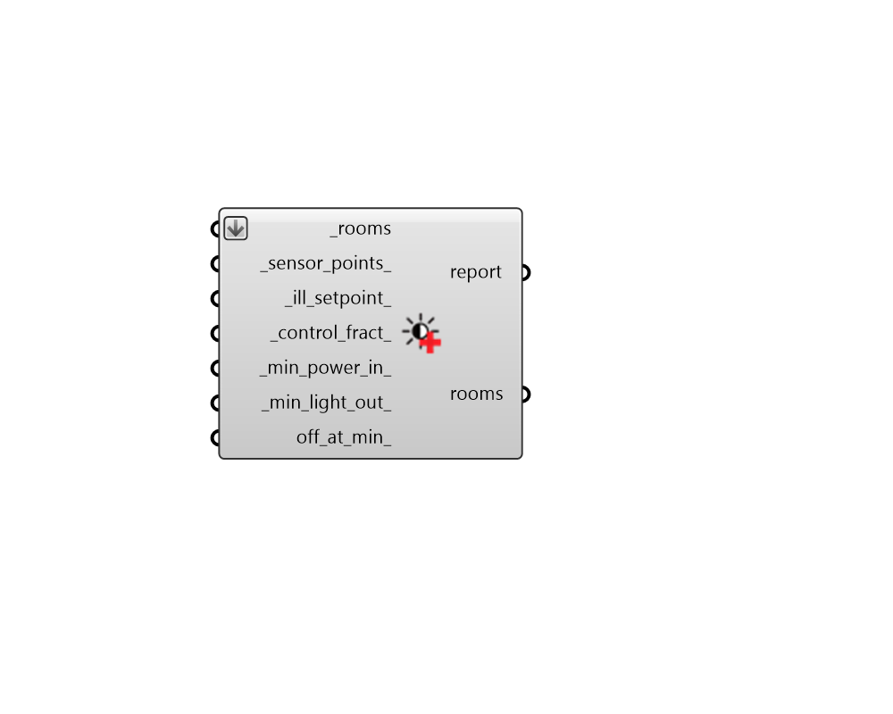

## Apply Daylight Control

 - [[source code]](https://github.com/ladybug-tools/honeybee-grasshopper-energy/blob/master/honeybee_grasshopper_energy/src//HB%20Apply%20Daylight%20Control.py)

Apply simple daylight controls to Rooms. 

Such simple controls will dim the lights in the energy simulation according to whether the illuminance at a sensor location is at a target illuminance setpoint. The method used to estimate illuiminance is fairly simple and, for more detailed control over the parameters used to compute illuminance, the "HB Daylight Control Schedule" component under HB-Radiance should be used. 

#### Inputs
* ##### rooms [Required]
Honeybee Rooms to which simple daylight controls should be assigned. 
* ##### sensor_points 
A list of point objects that align with the input _rooms and assign the position of the daylight sensor within the Room. This point should lie within the Room volume and a warning will be thrown and no daylight controls assigned for any point that lies outside the corresponding room. If unspecified, the sensor will be assigned to the center of the room at 0.8 meters above the floor. Note that such a center point might lie outside rooms that are significantly concave and no daylight controls will be assigned to these rooms in this case. 
* ##### ill_setpoint 
A number for the illuminance setpoint in lux beyond which electric lights are dimmed if there is sufficient daylight. Some common setpoints are listed below. (Default: 300 lux). 
50 lux - Corridors and hallways. 150 lux - Computer work spaces (screens provide illumination). 300 lux - Paper work spaces (reading from surfaces that need illumination). 500 lux - Retail spaces or museums illuminating merchandise/artifacts. 1000 lux - Operating rooms and workshops where light is needed for safety. 
* ##### control_fract 
A number between 0 and 1 that represents the fraction of the Room lights that are dimmed when the illuminance at the sensor position is at the specified illuminance. 1 indicates that all lights are dim-able while 0 indicates that no lights are dim-able. Deeper rooms should have lower control fractions to account for the face that the lights in the back of the space do not dim in response to suitable daylight at the front of the room. (Default: 1). 
* ##### min_power_in 
A number between 0 and 1 for the the lowest power the lighting system can dim down to, expressed as a fraction of maximum input power. (Default: 0.3). 
* ##### min_light_out 
A number between 0 and 1 the lowest lighting output the lighting system can dim down to, expressed as a fraction of maximum light output. (Default: 0.2). 
* ##### off_at_min 
Boolean to note whether lights should switch off completely when they get to the minimum power input. (Default: False). 

#### Outputs
* ##### report
Reports, errors, warnings, etc. 
* ##### rooms
The input Rooms with simple daylight controls assigned to them. 