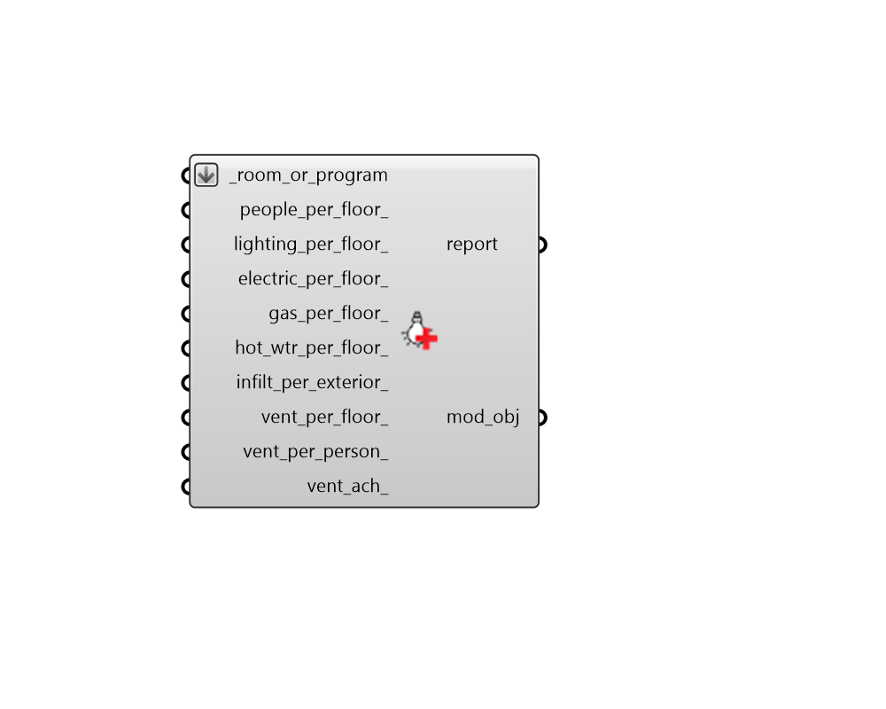

## Apply Load Values

 - [[source code]](https://github.com/ladybug-tools/honeybee-grasshopper-energy/blob/master/honeybee_grasshopper_energy/src//HB%20Apply%20Load%20Values.py)

Apply or edit load values on a Room or ProgramType. 

This component will not edit any of the schedule objects associated with each load value. If no schedule currently exists to describe how the load varies over the simulation, the "Always On" schedule will be used as a default. 

#### Inputs
* ##### room_or_program [Required]
Honeybee Rooms or ProgramType objects to which the input load objects should be assigned. This can also be the identifier of a ProgramType to be looked up in the program type library. This can also be a Honeybee Model for which all Rooms will be assigned the loads. 
* ##### people_per_floor 
A numerical value for the number of people per square meter of floor area. 
* ##### lighting_per_floor 
A numerical value for the lighting power density in Watts per square meter of floor area. 
* ##### electric_per_floor 
A numerical value for the electric equipment power density in Watts per square meter of floor area. 
* ##### gas_per_floor 
A numerical value for the gas equipment power density in Watts per square meter of floor area. 
* ##### hot_wtr_per_floor 
A numerical value for the total volume flow rate of water per unit area of floor in (L/h-m2). 
* ##### infilt_per_exterior 
A numerical value for the intensity of infiltration in m3/s per square meter of exterior surface area. Typical values for this property are as follows (note all values are at typical building pressures of ~4 Pa): 

    * 0.0001 (m3/s per m2 facade) - Tight building

    * 0.0003 (m3/s per m2 facade) - Average building

    * 0.0006 (m3/s per m2 facade) - Leaky building
* ##### vent_per_floor 
A numerical value for the intensity of outdoor air ventilation in m3/s per square meter of floor area. This will be added to the vent_per_person_ and vent_ach_ to produce the final minimum outdoor air specification. 
* ##### vent_per_person 
A numerical value for the intensity of outdoor air ventilation in m3/s per person. This will be added to the vent_per_floor_, and vent_ach_ to produce the final minimum outdoor air specification. Note that setting this value does not mean that ventilation is varied based on real-time occupancy but rather that the minimum level of ventilation is determined using this value and the People object of the zone. To vary ventilation on a timestep basis, a ventilation schedule should be used or the dcv_ option should be selected on the HVAC system if it is available. 
* ##### vent_ach 
A numerical value for the intensity of outdoor air ventilation in air changes er hour (ACH). This will be added to the vent_per_floor_ and vent_per_person_ to produce the final minimum outdoor air specification. 

#### Outputs
* ##### report
Reports, errors, warnings, etc. 
* ##### mod_obj
The input Rooms or ProgramTypes with their load values modified. 