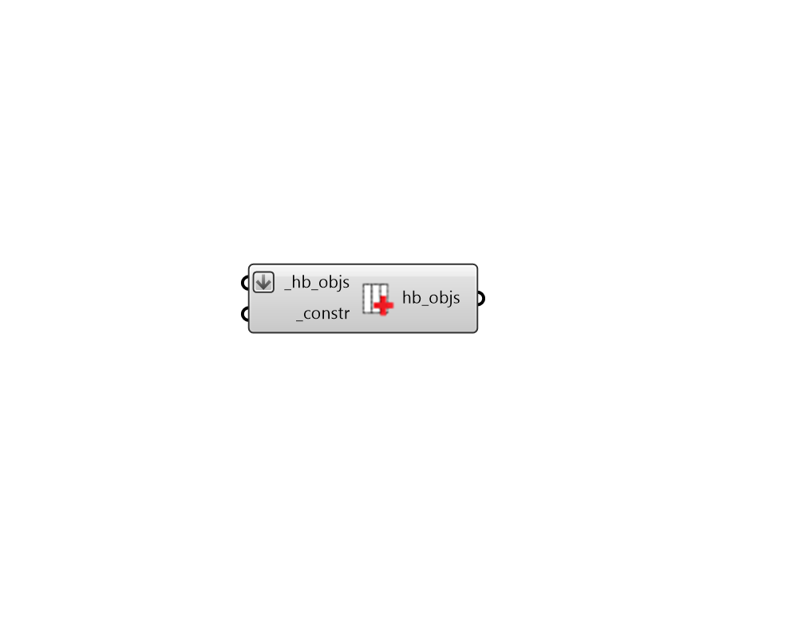

## Apply Opaque Construction

 - [[source code]](https://github.com/ladybug-tools/honeybee-grasshopper-energy/blob/master/honeybee_grasshopper_energy/src//HB%20Apply%20Opaque%20Construction.py)

Apply OpaqueConstruction to Honeybee Faces, Doors or Room walls. 

This component supports the assigning of different constructions based on cardinal orientation, provided that a list of OpaqueConstructions are input to the _constr.  

#### Inputs
* ##### hb_objs [Required]
Honeybee Faces, Doors, Rooms or a Model to which the input _constr should be assigned. For the case of a Room or a Model, the construction will only be applied to the Room's outdoor walls. Note that, if you need to assign a construction to all the roofs, floors, etc. of a Room, the best practice is to create a ConstructionSet and assing that to the Room. 
* ##### constr [Required]
A Honeybee OpaqueConstruction to be applied to the input _hb_objs. This can also be text for a construction to be looked up in the opaque construction library. If an array of text or construction objects are input here, different constructions will be assigned based on cardinal direction, starting with north and moving clockwise. 

#### Outputs
* ##### hb_objs
The input honeybee objects with their constructions edited. 