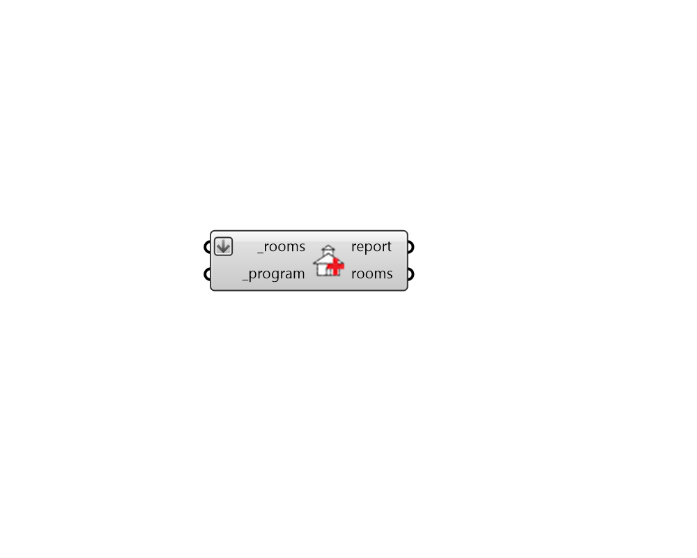

## Apply ProgramType

 - [[source code]](https://github.com/ladybug-tools/honeybee-grasshopper-energy/blob/master/honeybee_grasshopper_energy/src//HB%20Apply%20ProgramType.py)

Apply ProgramType objects to Rooms. 

#### Inputs
* ##### rooms [Required]
Honeybee Rooms to which the input load objects should be assigned. 
* ##### program [Required]
A ProgramType object to apply to the input rooms, 

#### Outputs
* ##### report
Reports, errors, warnings, etc. 
* ##### rooms
The input Rooms with their loads edited. 