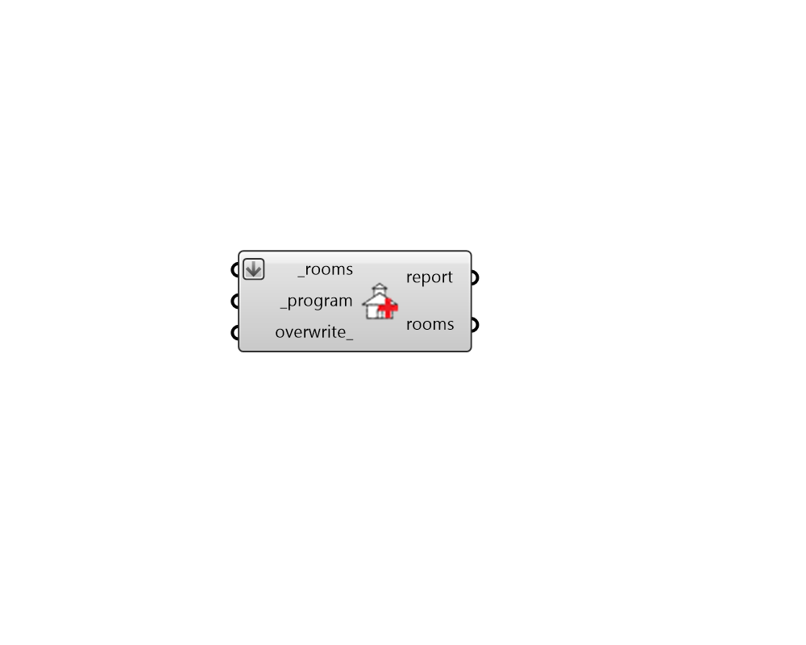

## Apply ProgramType

 - [[source code]](https://github.com/ladybug-tools/honeybee-grasshopper-energy/blob/master/honeybee_grasshopper_energy/src//HB%20Apply%20ProgramType.py)

Apply ProgramType objects to Rooms or a Model. 

#### Inputs
* ##### rooms [Required]
Honeybee Rooms to which the input program should be assigned. This can also be a Honeybee Model for which all Rooms will be assigned the ProgramType. 
* ##### program [Required]
A ProgramType object to apply to the input rooms. This can also be text for the program of the Rooms (to be looked up in the ProgramType library) such as that output from the "HB List Programs" component. 
* ##### overwrite 
A Boolean to note whether any loads assigned specifically to the Room, which overwrite the loads of ProgramType should be reset so that they are determined by the input program. (Default: False). 

#### Outputs
* ##### report
Reports, errors, warnings, etc. 
* ##### rooms
The input Rooms with their loads edited. 