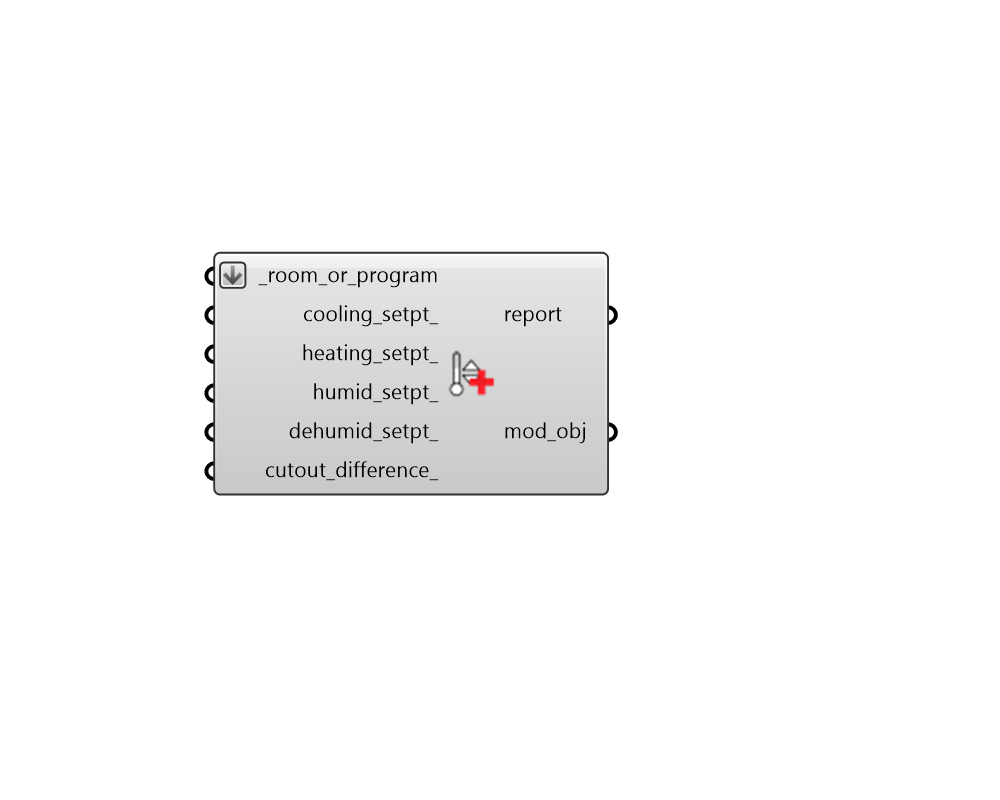

## Apply Setpoint Values

 - [[source code]](https://github.com/ladybug-tools/honeybee-grasshopper-energy/blob/master/honeybee_grasshopper_energy/src//HB%20Apply%20Setpoint%20Values.py)

Apply values for setpoints to a Room or ProgramType. 

#### Inputs
* ##### room_or_program [Required]
Honeybee Rooms or ProgramType objects to which the input setpoints should be assigned. This can also be the identifier of a ProgramType to be looked up in the program type library. This can also be a Honeybee Model for which all Rooms will be assigned the setpoints. 
* ##### cooling_setpt 
A numerical value for a single constant temperature for the cooling setpoint [C]. 
* ##### heating_setpt 
A numerical value for a single constant temperature for the heating setpoint [C]. 
* ##### humid_setpt 
A numerical value for a single constant value for the humidifying setpoint [%]. 
* ##### dehumid_setpt 
A numerical value for a single constant value for the dehumidifying setpoint [%]. 
* ##### cutout_difference 
An optional positive number for the temperature difference between the cutout temperature and the setpoint temperature. Specifying a non-zero number here is useful for modeling the throttling range associated with a given setup of setpoint controls and HVAC equipment. Throttling ranges describe the range where a zone is slightly over-cooled or over-heated beyond the thermostat setpoint. They are used to avoid situations where HVAC systems turn on only to turn off a few minutes later, thereby wearing out the parts of mechanical systems faster. They can have a minor impact on energy consumption and can often have significant impacts on occupant thermal comfort, though using the default value of zero will often yield results that are close enough when trying to estimate the annual heating/cooling energy use. Specifying a value of zero effectively assumes that the system will turn on whenever conditions are outside the setpoint range and will cut out as soon as the setpoint is reached. (Default: 0). 

#### Outputs
* ##### report
Reports, errors, warnings, etc. 
* ##### mod_obj
The input Rooms or ProgramTypes with their setpoint values edited. 