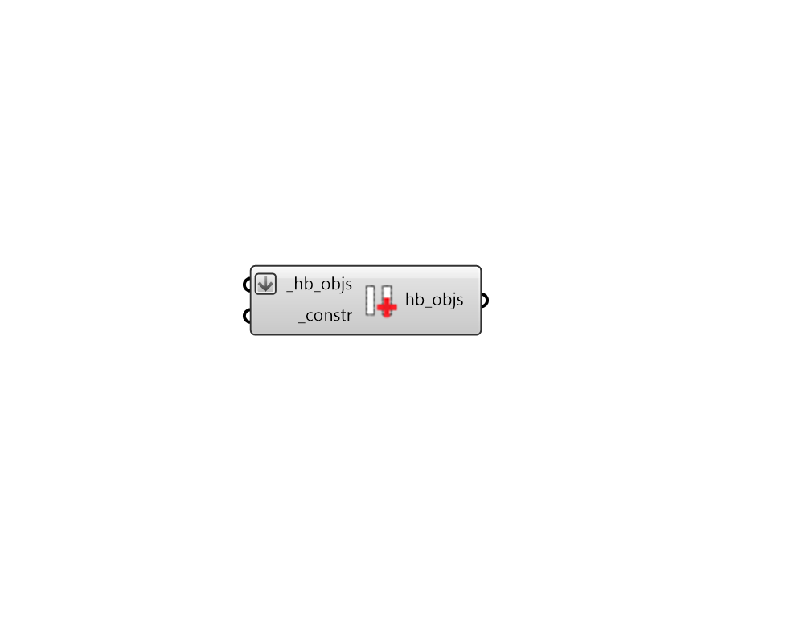

## Apply Window Construction

 - [[source code]](https://github.com/ladybug-tools/honeybee-grasshopper-energy/blob/master/honeybee_grasshopper_energy/src//HB%20Apply%20Window%20Construction.py)

Apply WindowConstruction or WindowConstructionShade to Honeybee Apertures or glass Doors. Alternatively, it can assign WindowConstructions to the child apertures of input Faces or the apertures within Room walls. 

This component supports the assigning of different constructions based on cardinal orientation, provided that a list of WindowConstructions are input to the _constr.  

#### Inputs
* ##### hb_objs [Required]
Honeybee Apertures, Faces, Doors or Rooms to which the input _constr should be assigned. For the case of a Honeybee Room, the construction will only be applied to the apertures in the the Room's outdoor walls. Note that, if you need to assign a construction to all the skylights, glass doors, etc. of a Room, the best practice is to create a ConstructionSet and assing that to the Room. 
* ##### constr [Required]
A Honeybee WindowConstruction or WindowConstructionShade to be applied to the input _hb_objs. This can also be text for a construction to be looked up in the window construction library. If an array of text or construction objects are input here, different constructions will be assigned based on cardinal direction, starting with north and moving clockwise. 

#### Outputs
* ##### hb_objs
The input honeybee objects with their constructions edited. 