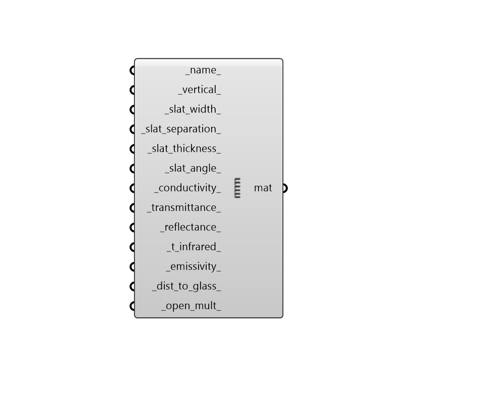

## Blind Material

 - [[source code]](https://github.com/ladybug-tools/honeybee-grasshopper-energy/blob/master/honeybee_grasshopper_energy/src//HB%20Blind%20Material.py)

Create a material for a blind layer in a window construction. This material can be plugged into the "HB Window Construction" component. 

Window blind properties consist of flat, equally-spaced slats. 

#### Inputs
* ##### name 
Text to set the name for the material and to be incorporated into a unique material identifier. 
* ##### vertical 
Set to "True" to have the blinds be vertically-oriented and set to "False" to have them be horizontally-oriented. (Default: False for horizontal). 
* ##### slat_width 
The width of slat measured from edge to edge [m]. (Default: 0.025 m). 
* ##### slat_separation 
The distance between each of the slats [m]. (Default: 0.01875 m). 
* ##### slat_thickness 
A number between 0 and 0.1 for the thickness of the slat in meters. (Default: 0.001 m). 
* ##### slat_angle 
A number between 0 and 180 for the angle between the slats and the glazing normal in degrees. 90 signifies slats that are perpendicular to the glass. (Default: 45). 
* ##### conductivity 
Number for the thermal conductivity of the blind material [W/m-K]. (Default: 221, typical of aluminum blinds). 
* ##### transmittance 
Number between 0 and 1 for the transmittance of solar radiation and visible light through the blind material. (Default: 0). 
* ##### reflectance 
Number between 0 and 1 for the reflectance of solar radiation and visible light off of the blind material. (Default: 0.5, which is typical of a painted white blind). 
* ##### t_infrared 
Long-wave hemispherical transmittance of the blind material. (Default: 0). 
* ##### emissivity 
Number between 0 and 1 for the infrared hemispherical emissivity of the blind material. (Default: 0.9, which is typical of most painted blinds). 
* ##### dist_to_glass 
A number between 0.001 and 1.0 for the distance between the blind edge and neighboring glass layers [m]. (Default: 0.05 m). 
* ##### open_mult 
Factor between 0 and 1 that is multiplied by the area at the top, bottom and sides of the blind for air flow calculations. (Default: 0.5). 

#### Outputs
* ##### mat
A material for a blind layer in a window construction that can be assigned to a Honeybee Window construction. 