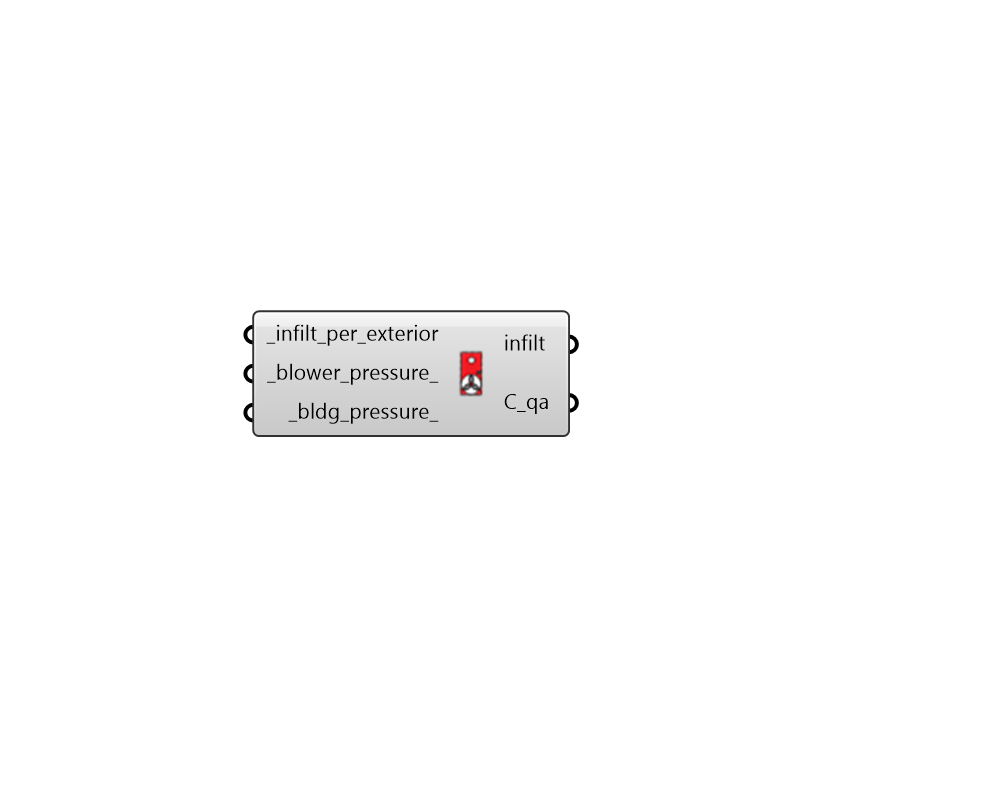

## Blower Pressure Converter

 - [[source code]](https://github.com/ladybug-tools/honeybee-grasshopper-energy/blob/master/honeybee_grasshopper_energy/src//HB%20Blower%20Pressure%20Converter.py)

Convert infiltration flow per exterior area measured at a particular blower door pressure to flow per exterior area measured at a typical building pressure. 

This is accomplished by computing a normalized-area air mass flow coefficient that is derived the power law relationship between pressure and air flow.     Cqa = Qblow / dPblow^n And then using the coefficient to approximate air flow at typical building pressure.     Qbldg = Cqa * dPbldg^n 

where:     Cqa: Air mass flow coefficient per unit meter at 1 Pa [kg/m2/s/P^n]     Qblow: Blower-induced volumetric air flow rate per area [m3/s/m2]     dPblow: Blower-induced change in pressure across building envelope orifice [Pa]     Qbldg: Typical building volumetric air flow rate per area [m3/s/m2]     dPbldg: Typical building change in pressure across building envelope orifice [Pa]     d: Air density [1.2041 kg/m3]     n: Air mass flow exponent [0.65] 

#### Inputs
* ##### infilt_per_exterior [Required]
A numerical value for the intensity of air flow induced by blower pressure in m3/s per square meter of exterior surface area. 
* ##### blower_pressure 
A number representing the pressure differential in Pascals (Pa) between indoors/outdoors at which the specified _infilt_per_exterior occurs. Typical pressures induced by blower doors are 75 Pa and 50 Pa. (Default: 75). 
* ##### bldg_pressure 
The reference air pressure difference across building envelope under typical conditions in Pascals. (Default: 4). 

#### Outputs
* ##### infilt
The intensity of infiltration in m3/s per square meter of exterior surface area at the input _bldg_pressure_. 
* ##### C_qa
Air mass flow coefficient per square meter at 1 Pa [kg/m2/s/P^n]. 