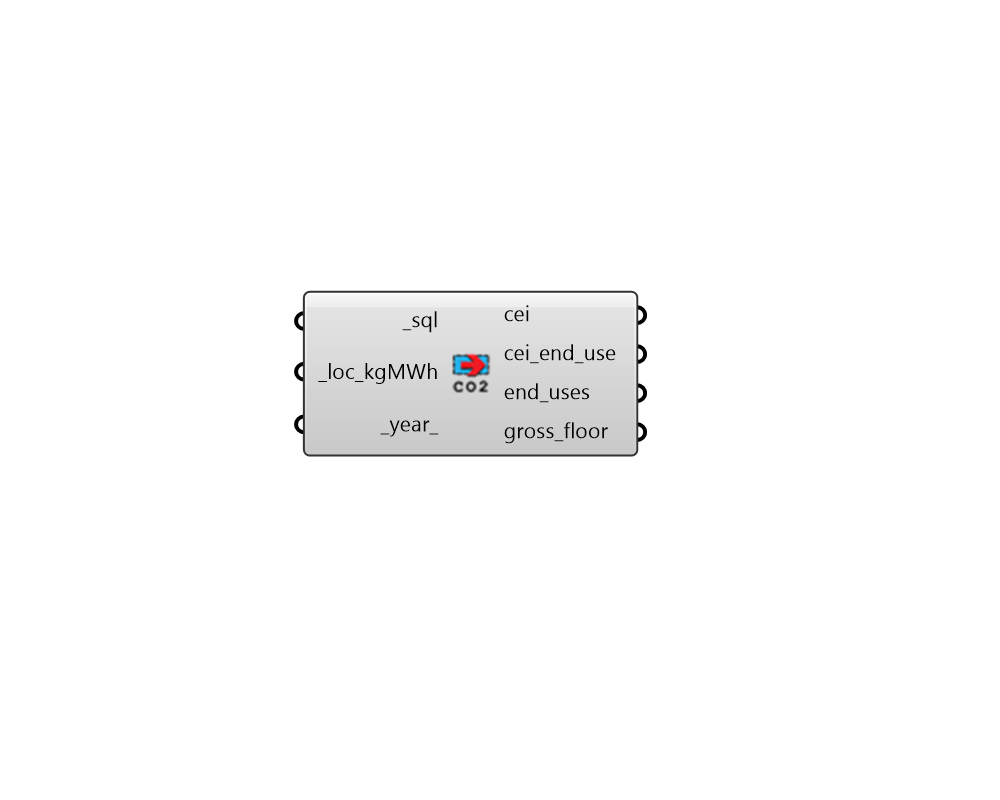

## Carbon Emission Intensity

 - [[source code]](https://github.com/ladybug-tools/honeybee-grasshopper-energy/blob/master/honeybee_grasshopper_energy/src//HB%20Carbon%20Emission%20Intensity.py)

Get information about carbon emission intensity (CEI) from an EnergyPlus SQL file. 

The location and year (or input emissions of electricity intensity) will be used to compute carbon intensity for both electricity and district heating/cooling. Fixed numbers will be used to convert the following on-site fuel sources: 

* Natural Gas --  277.358 kg/MWh * Propane -- 323.897 kg/MWh * Fuel Oil -- 294.962 kg/MWh 

#### Inputs
* ##### sql [Required]
The file path of the SQL result file that has been generated from an energy simulation. This can also be a list of EnergyPlus files in which case EUI will be computed across all files. Lastly, it can be a directory or list of directories containing results, in which case, EUI will be calculated form all files ending in .sql. 
* ##### loc_kgMWh [Required]
A ladybug Location object in the USA, which will be used to determine the subregion of the electrical grid. Alternatively, it can be A number for the electric grid carbon emissions in kg CO2/MWh. The following rules of thumb may be used as a guide: 

    * 800 kg/MWh - an inefficient coal or oil-dominated grid (West Virgina in 2020)

    * 400 kg/MWh - the average US (energy mixed) grid around 2020

    * 200-400 kg/MWh - for grids in transition to renewables

    * 100-200 kg/MWh - for grids with majority renewable/nuclear composition

    * 0-100 kg/MWh - for grids with renewables and storage
* ##### year 
An integer for the future year for which carbon emissions will be estimated. Values must be an even number and be between 2020 and 2050. (Default: 2030). 

#### Outputs
* ##### cei
A number for the total annual carbon emission intensity (CEI). This is the sum of all operational carbon emissions divided by the gross floor area (including both conditioned and unconditioned spaces). Units are kg CO2/m2. 
* ##### cei_end_use
The carbon emission intensity broken down by each end use. These values coorespond to the end_uses output below. Values are in kg CO2/m2 . 
* ##### end_uses
A list of text for each of the end uses in the simulation (Heating, Cooling, etc.). Thes outputs coorespond to the eui_end_use output above. 
* ##### gross_floor
The total gross floor area of the energy model. This can be used to compute the total energy use from the intensity values above or it can be used to help with other result post-processing. The value will be in m2 if ip_ is False or None and ft2 if True. 