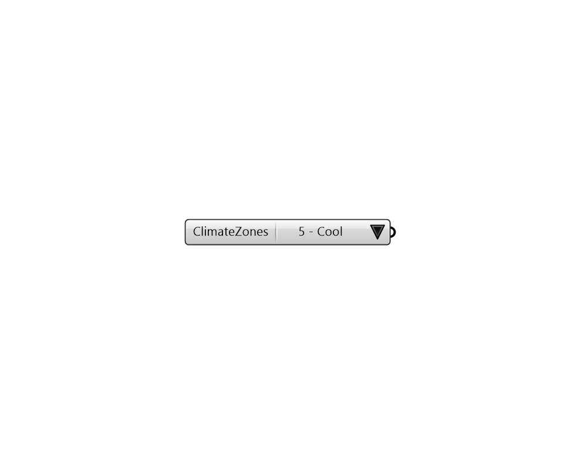

## Climate Zones

 - [[source code]](https://github.com/ladybug-tools/honeybee-grasshopper-energy/blob/master/honeybee_grasshopper_energy/src//HB%20Climate%20Zones.py)

Provides a list of available climate zones in the library. 