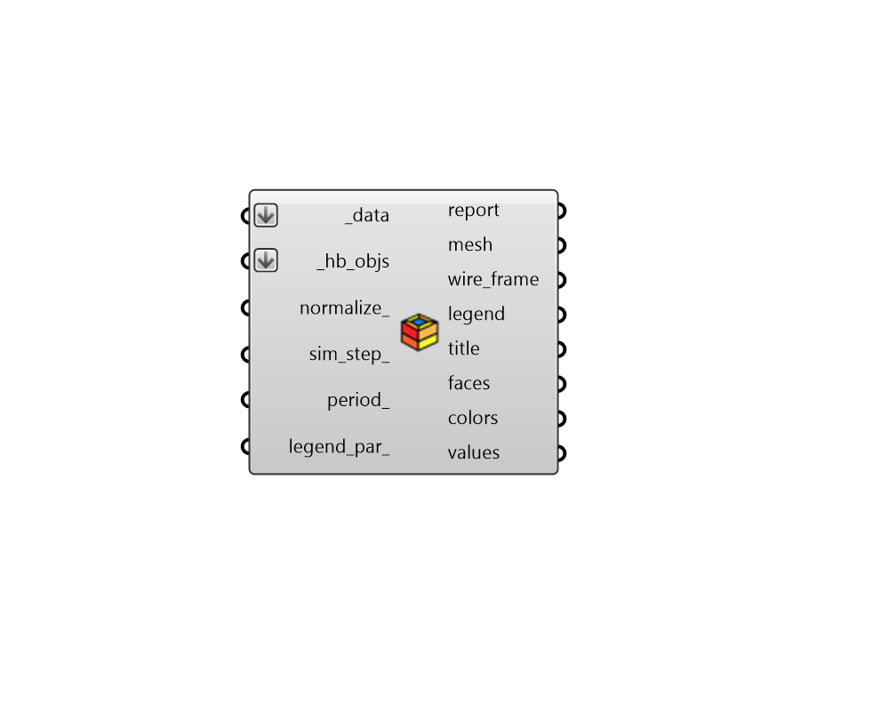

## Color Faces

 - [[source code]](https://github.com/ladybug-tools/honeybee-grasshopper-energy/blob/master/honeybee_grasshopper_energy/src//HB%20Color%20Faces.py)

Visualize face and sub-face level energy simulation results as colored geometry. 

#### Inputs
* ##### data [Required]
A list of data collections of the same data type, which will be used to color Faces with simulation results. Data collections can be of any class (eg. MonthlyCollection, DailyCollection) but they should all have headers with metadata dictionaries with 'Surface' keys. These keys will be used to match the data in the collections to the input faces. 
* ##### hb_objs [Required]
An array of honeybee Rooms, Faces, Apertures or Doors to be colored with simulation results in the Rhino scene. This can also be an entire Model to be colored. 
* ##### normalize 
Boolean to note whether results should be normalized by the face/sub-face area if the data type of the data_colections supports it. If False, values will be generated using sum total of the data collection values. Note that this input has no effect if the data type of the data_collections is not normalizable since data collection values will always be averaged for this case. (Default: True). 
* ##### sim_step 
An optional integer (greater than or equal to 0) to select a specific step of the data collections for which result values will be generated. If None, the geometry will be colored with the total of resutls in the data_collections if the data type is cumulative or with the average of results if the data type is not cumulative. (Default: None). 
* ##### period 
A Ladybug analysis period to be applied to all of the input _data. 
* ##### legend_par 
An optional LegendParameter object to change the display of the ColorRooms. 

#### Outputs
* ##### report
... 
* ##### mesh
A colored mesh of the face/sub-face geometry colored using the input _data. Multiple meshes will be output for several data collections are input. 
* ##### wire_frame
A list of polylines representing the outline of the faces. 
* ##### legend
Geometry representing the legend for the colored favess. 
* ##### title
A text object for the global title. 
* ##### faces
A list of honeybee Face, Aperture and Door objects that have been matched to the input _data. This can be plugged into the "HB Visualize Quick" component to get face breps that are colored. 
* ##### colors
A list of color objects that align with the output faces. These can be connected to a native Grasshopper "Custom Preview" component in order to color room volumes with results. 
* ##### values
A list of numbers for each of the faces, which are used to generate the colors. 
* ##### vis_set
An object containing VisualizationSet arguments for drawing a detailed version of the ColorRoom in the Rhino scene. This can be connected to the "LB Preview Visualization Set" component to display this version of the visualization in Rhino. 