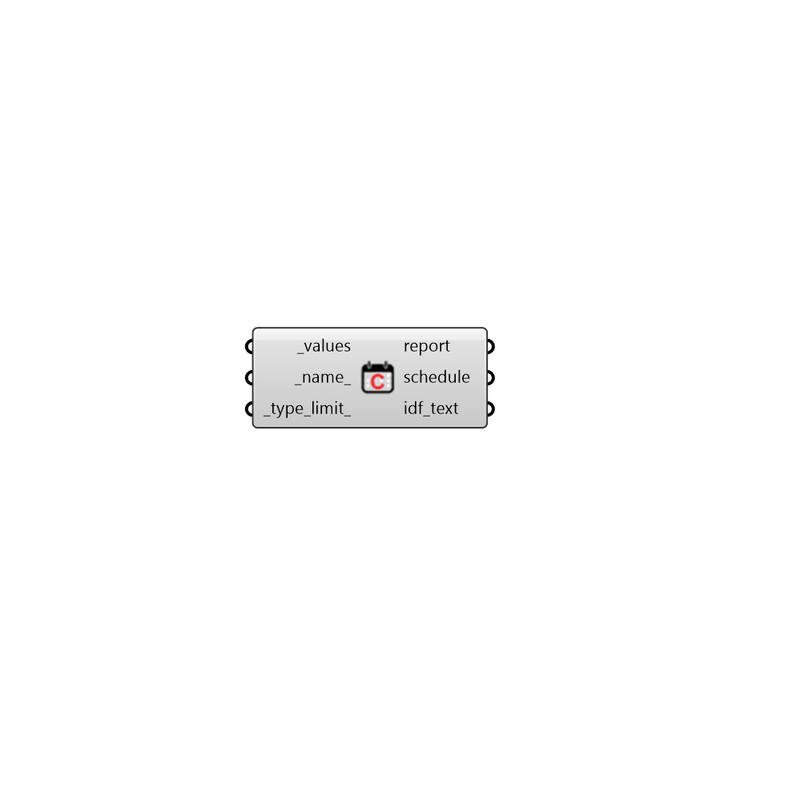

## Constant Schedule

 - [[source code]](https://github.com/ladybug-tools/honeybee-grasshopper-energy/blob/master/honeybee_grasshopper_energy/src//HB%20Constant%20Schedule.py)

Create a schedule from a single constant value or a list of 24 hourly values repeating continuously over every day of the year. 

#### Inputs
* ##### values [Required]
A list of 24 values that represent the schedule values at each hour of the day. This can also be a single constant value for the whole day. 
* ##### name 
Text to set the name for the Schedule and to be incorporated into a unique Schedule identifier. 
* ##### type_limit 
A text string from the identifier of the ScheduleTypeLimit to be looked up in the schedule type limit library. This can also be a custom ScheduleTypeLimit object from the "HB Type Limit" component. The input here will be used to validate schedule values against upper/lower limits and assign units to the schedule values. Default: "Fractional" for values that range continuously between 0 and 1. Choose from the following built-in options: 

    * Fractional

    * On-Off

    * Temperature

    * Activity Level

    * Power

    * Humidity

    * Angle

    * Delta Temperature

    * Control Level

#### Outputs
* ##### report
Reports, errors, warnings, etc. 
* ##### schedule
A ScheduleRuleset object that can be assigned to a Room, a Load object, or a ProgramType object. 
* ##### idf_text
Text strings for the EnergyPlus Schedule that will ultimately be written into the IDF for simulation. This can also be used to add the schedule to the schedule library that is loaded up upon the start of Honeybee by copying this text into the honeybee/library/schedules/ user_library.idf file. 