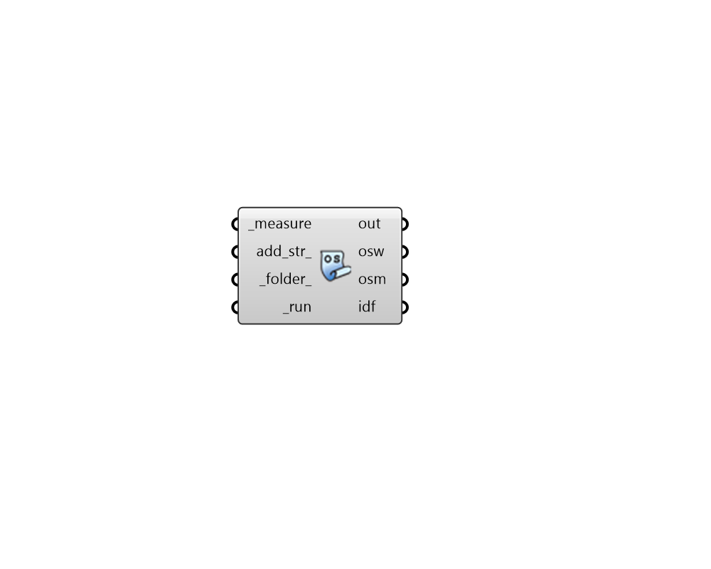

## Create OSM Measure

 - [[source code]](https://github.com/ladybug-tools/honeybee-grasshopper-energy/blob/master/honeybee_grasshopper_energy/src//HB%20Create%20OSM%20Measure.py)

Run an OpenStudio Meausre that is intended to create an entire OSM file (OpenStudio Model). Examples of such measures include the "Create DOE Prototype Building" measure such as that wich can be downloaded here: 

https://github.com/NREL/openstudio-model-articulation-gem/tree/develop/lib/ measures/create_DOE_prototype_building 

#### Inputs
* ##### measure [Required]
A Measure from the "HB Load Measure" component that is intended to generate an OSM from input arguments. Measures can be downloaded from the NREL Building Components Library (BCL) at (https://bcl.nrel.gov/). 
* ##### add_str 
Optional additional text strings here to be written into the IDF. The input here should be complete EnergyPlus objects as a single string following the IDF format. This can be used to add addition EnergyPlus outputs in the resulting IDF among other features. 
* ##### folder 
An optional folder on this computer, into which the IDF and OSM files will be written. If none, a sub-folder within the default simulation folder will be used. 
* ##### run [Required]
Script variable Python 

#### Outputs
* ##### out
The execution information, as output and error streams 
* ##### osw
File path to the OpenStudio Workflow JSON on this machine. This workflow is executed using the OpenStudio command line interface (CLI) and it includes measures to create the OSM from the measure 
* ##### osm
The file path to the OpenStudio Model (OSM) that has been generated on this computer. 
* ##### idf
The file path of the EnergyPlus Input Data File (IDF) that has been generated on this computer. 