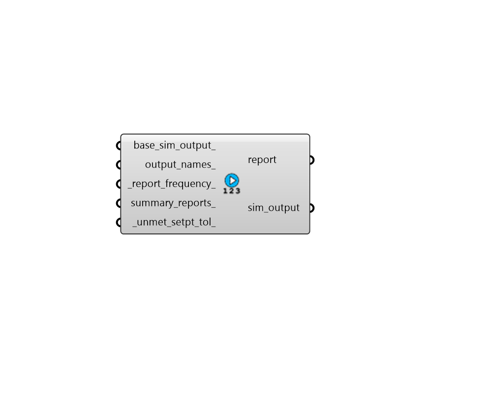

## Custom Simulation Output

 - [[source code]](https://github.com/ladybug-tools/honeybee-grasshopper-energy/blob/master/honeybee_grasshopper_energy/src//HB%20Custom%20Simulation%20Output.py)

Create a custom simulation output object by plugging in one or more names of EnergyPlus simulation ouputs. The resulting object can be used to request output variables from EnergyPlus. 

#### Inputs
* ##### base_sim_output 
An optional simulation output object to serve as the starting point for the sim_output object returned by this component. All of the output names will simply be appended to this initial starting object. 
* ##### output_names 
A list of EnergyPlus output names as strings (eg. 'Surface Window System Solar Transmittance'. These outputs will be requested from the simulation. 
* ##### report_frequency 
Text for the frequency at which the outputs are reported. Default: 'Hourly'. Choose from the following: 

    * Annual

    * Monthly

    * Daily

    * Hourly

    * Timestep
* ##### summary_reports 
An optional list of EnergyPlus summary report names as strings. If None, only the 'AllSummary' report will be requested from the simulation and will appear in the HTML report output by EnergyPlus. See the Input Output Reference SummaryReports section for a full list of all reports that can be requested. https://bigladdersoftware.com/ epx/docs/9-1/input-output-reference/output-table-summaryreports.html 
* ##### unmet_setpt_tol 
A number in degrees Celsius for the difference that the zone conditions must be from the thermostat setpoint in order for the setpoint to be considered unmet. This will affect how unmet hours are reported in the output. ASHRAE 90.1 uses a tolerance of 1.11C, which is equivalent to 1.8F. (Default: 1.11C). 

#### Outputs
* ##### report
Report! 
* ##### sim_output
A SimulationOutput object that can be connected to the "HB Simulation Parameter" component in order to specify which types of outputs should be written from EnergyPlus. 