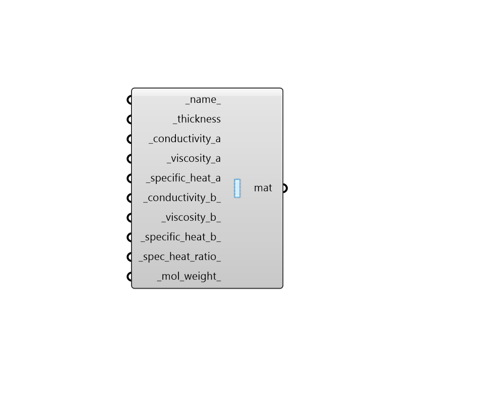

## Custom Window Gap Material

 - [[source code]](https://github.com/ladybug-tools/honeybee-grasshopper-energy/blob/master/honeybee_grasshopper_energy/src//HB%20Custom%20Window%20Gap%20Material.py)

Create a custom gas gap material that corresponds to a layer in a window construction. This material can be plugged into the "HB Window Construction" component. 

This object allows you to specify specific values for conductivity, viscosity and specific heat through the following formula:     property = A + (B * T) where:     A, B = regression coefficients for the gas     T = temperature [K] 

#### Inputs
* ##### name 
Text to set the name for the material and to be incorporated into a unique material identifier. 
* ##### thickness [Required]
Number for the thickness of the gas gap layer in meters. 
* ##### conductivity_a [Required]
First conductivity coefficient. Or condictivity in [W/m-K] if b coefficient is 0. 
* ##### viscosity_a [Required]
First viscosity coefficient. Or viscosity in [kg/m-s] if b coefficient is 0. 
* ##### specific_heat_a [Required]
First specific heat coefficient. Or the specific heat in [J/kg-K] if b coefficient is 0. 
* ##### conductivity_b 
Second conductivity coefficient. (Default: 0). 
* ##### viscosity_b 
Second viscosity coefficient. (Default: 0). 
* ##### specific_heat_b 
Second specific heat coefficient. (Default: 0). 
* ##### spec_heat_ratio 
A number for the the ratio of the specific heat a contant pressure, to the specific heat at constant volume. (Default: 1.0 for Air). 
* ##### mol_weight 
Number between 20 and 200 for the mass of 1 mol of the substance in grams. (Default: 20.0). 

#### Outputs
* ##### mat
A custom gas gap material that describes a layer in a window construction and can be assigned to a Honeybee Window construction. 