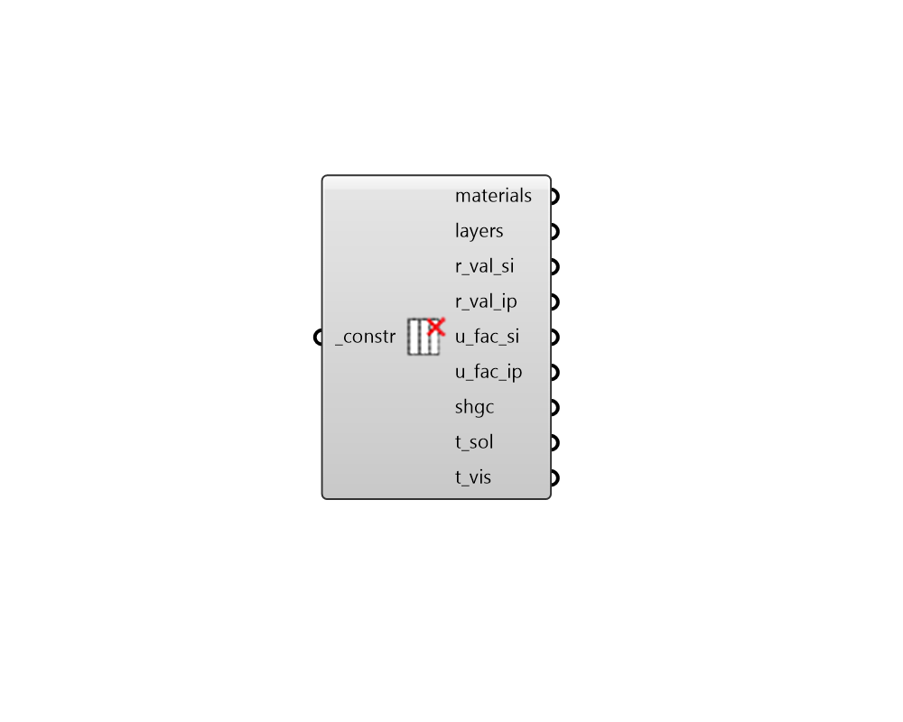

## Deconstruct Construction

 - [[source code]](https://github.com/ladybug-tools/honeybee-grasshopper-energy/blob/master/honeybee_grasshopper_energy/src//HB%20Deconstruct%20Construction.py)

Deconstruct an opaque or window construction into its constituient materials. 

#### Inputs
* ##### constr [Required]
An opaque or window construction to be deconstructed. This can also be text for an opaque or window construction to be looked up in the construction library. 

#### Outputs
* ##### materials
List of material objects that make up the construction (ordered from outside to inside). 
* ##### layers
List of material identifiers that make up the construction (ordered from outside to inside). 
* ##### r_val_si
R-value of the construction in m2-K/W. Note that R-values do NOT include the resistance of air films on either side of the construction. 
* ##### r_val_ip
R-value of the construction in h-ft2-F/Btu. Note that R-values do NOT include the resistance of air films on either side of the construction. 
* ##### u_fac_si
U-factor of the construction in W/m2-K.  Note that U-factors include the resistance of air films on either side of the construction. 
* ##### u_fac_ip
U-factor of the construction in Btu/h-ft2-F.  Note that U-factors include the resistance of air films on either side of the construction. 
* ##### t_sol
The unshaded shortwave solar transmittance of the construction at normal incidence. Note that 'unshaded' in this case means that all blind + shade materials in the construction are ignored. Also note that the solar transmittance ouput here is only for shortwave solar irradiation. So it is NOT the same as SHGC or G-Value, which also includes the solar heat that is absorbed by the construction and then conducts to the indoors. 
* ##### t_vis
The unshaded visible transmittance of the window at normal incidence. Note that 'unshaded' in this case means that all blind + shade materials in the construction are ignored. 