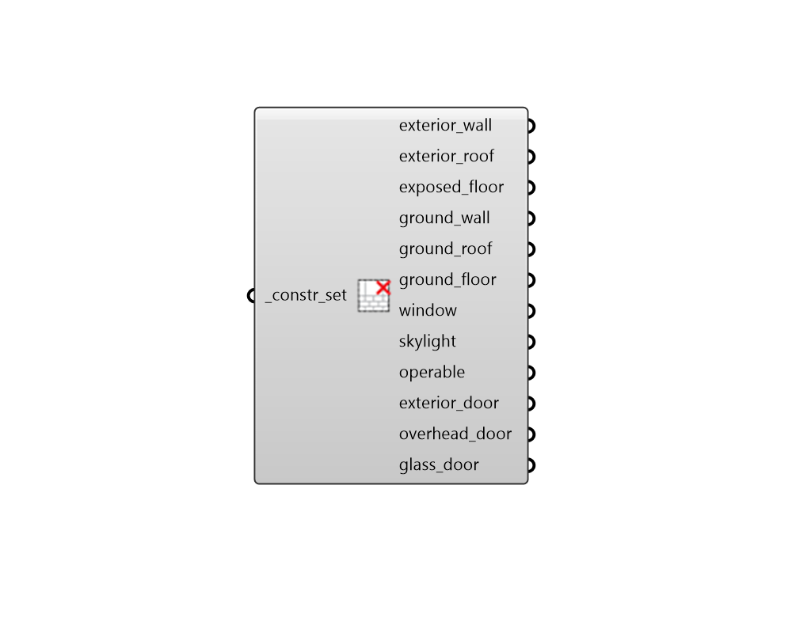

## Deconstruct ConstructionSet

 - [[source code]](https://github.com/ladybug-tools/honeybee-grasshopper-energy/blob/master/honeybee_grasshopper_energy/src//HB%20Deconstruct%20ConstructionSet.py)

Deconstruct a construction set into its constituient exterior constructions. 

#### Inputs
* ##### constr_set [Required]
A construction set to be deconstructed. This can also be text for a construction set to be looked up in the construction set library. 

#### Outputs
* ##### exterior_wall
A construction object for the set's exterior walls. 
* ##### exterior_roof
A construction object for the set's exterior roofs. 
* ##### exposed_floor
A construction object for the set's exposed floors. 
* ##### ground_wall
A construction object for the set's underground walls. 
* ##### ground_roof
A construction object for the set's underground roofs. 
* ##### ground_floor
A construction object for the set's ground-contact floors. 
* ##### window
A construction object for apertures with an Outdoors boundary condition and a Wall face type for their parent face. 
* ##### skylight
A construction object for apertures with an Outdoors boundary condition and a RoofCeiling or Floor face type for their parent face. 
* ##### operable
A construction object for apertures with an Outdoors boundary condition and True is_operable property. 
* ##### exterior_door
A construction object for opaque doors with an Outdoors boundary condition and a Wall face type for their parent face. 
* ##### overhead_door
A construction object for opaque doors with an Outdoors boundary condition and a RoofCeiling or Floor face type for their parent face. 
* ##### glass_door
A construction object for all glass doors with an Outdoors boundary condition. 