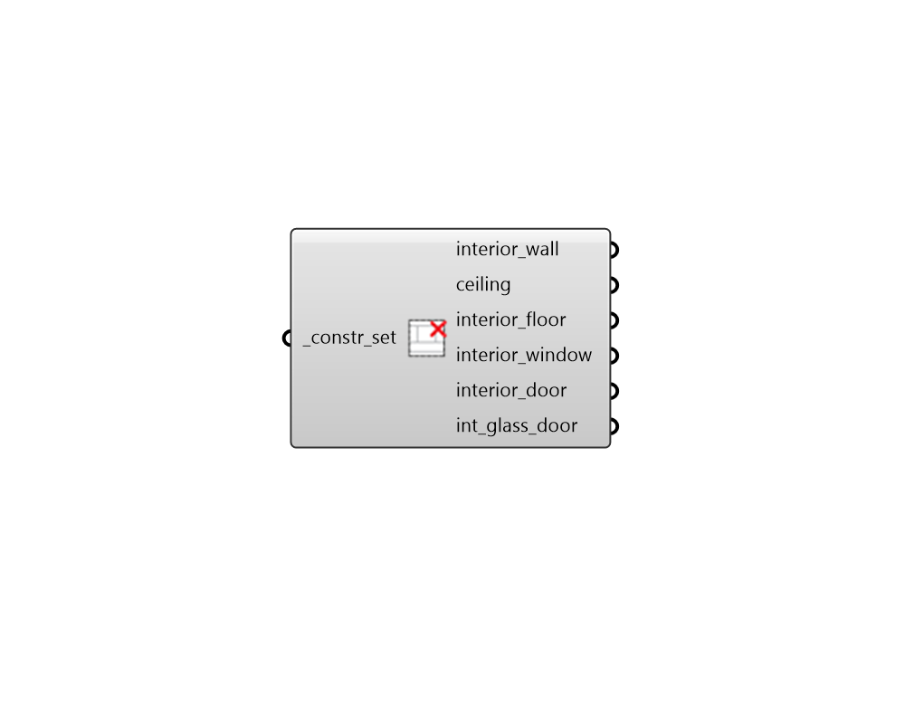

## Deconstruct ConstructionSet Interior

 - [[source code]](https://github.com/ladybug-tools/honeybee-grasshopper-energy/blob/master/honeybee_grasshopper_energy/src//HB%20Deconstruct%20ConstructionSet%20Interior.py)

Deconstruct a construction set into its constituient interior constructions. 

#### Inputs
* ##### constr_set [Required]
A construction set to be deconstructed. This can also be text for a construction set to be looked up in the construction set library. 

#### Outputs
* ##### interior_wall
A construction object for the set's interior walls. 
* ##### ceiling
A construction object for the set's interior roofs. 
* ##### interior_floor
A construction object for the set's interior floors. 
* ##### interior_window
A construction object for all apertures with a Surface boundary condition. 
* ##### interior_door
A construction object for all opaque doors with a Surface boundary condition. 
* ##### int_glass_door
A construction object for all glass doors with a Surface boundary condition. 