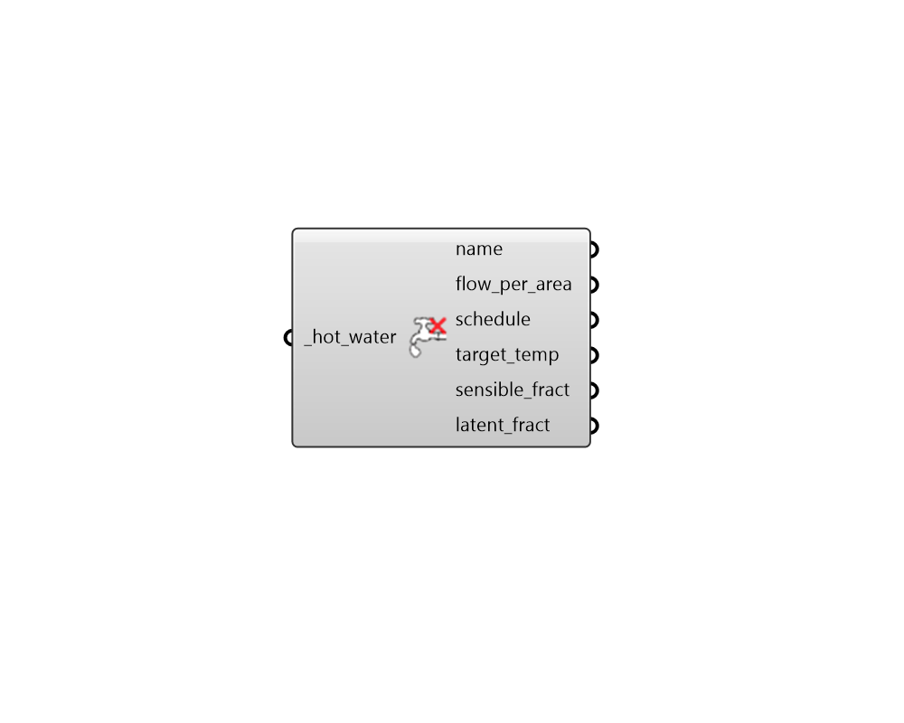

## Deconstruct Hot Water

 - [[source code]](https://github.com/ladybug-tools/honeybee-grasshopper-energy/blob/master/honeybee_grasshopper_energy/src//HB%20Deconstruct%20Hot%20Water.py)

Deconstruct a ServiceHotWater object into its constituient properties. 

#### Inputs
* ##### hot_water [Required]
A ServiceHotWater object to be deconstructed. 

#### Outputs
* ##### name
An Equipment object that can be used to create a ProgramType or be assigned directly to a Room. 
* ##### flow_per_area
A numerical value for the total volume flow rate of water per unit area of floor (L/h-m2). 
* ##### schedule
A fractional schedule for the use of hot water over the course of the year. The fractional values will get multiplied by the _flow_per_area to yield a complete water usage profile. 
* ##### target_temp
The target temperature of the water out of the tap in Celsius. This the temperature after the hot water has been mixed with cold water from the water mains. 
* ##### sensible_fract
A number between 0 and 1 for the fraction of the total hot water load given off as sensible heat in the zone. 
* ##### latent_fract
A number between 0 and 1 for the fraction of the total hot water load that is latent (as opposed to sensible). 