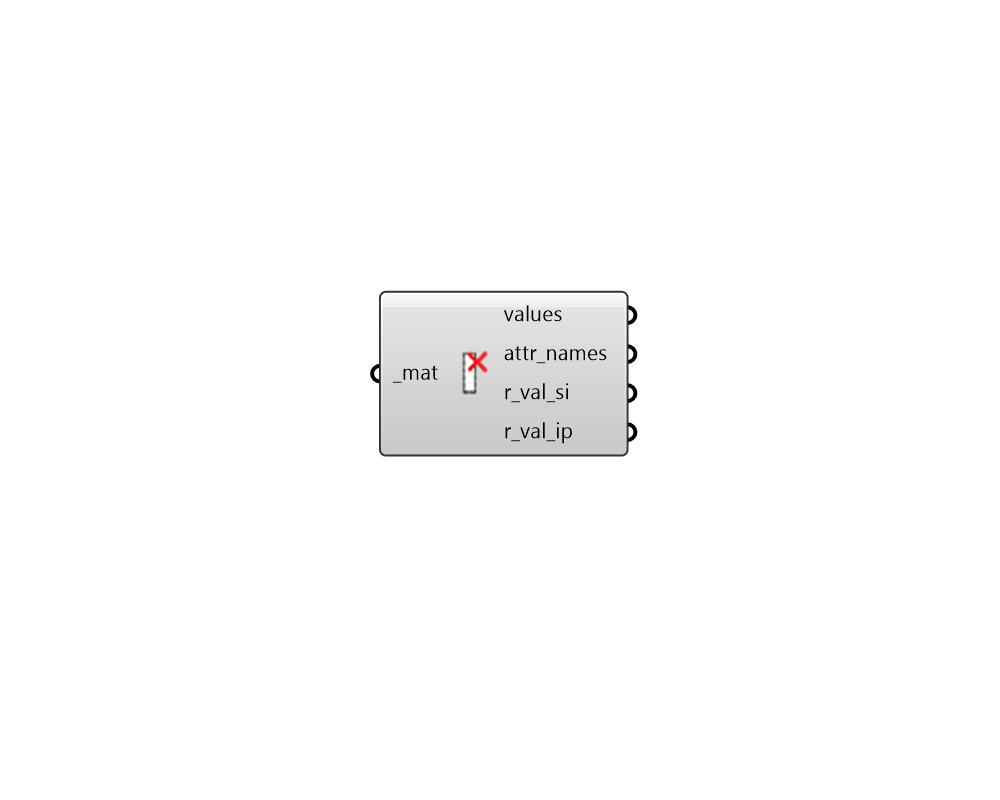

## Deconstruct Material

 - [[source code]](https://github.com/ladybug-tools/honeybee-grasshopper-energy/blob/master/honeybee_grasshopper_energy/src//HB%20Deconstruct%20Material.py)

Deconstruct a material into its constituient attributes and values. 

#### Inputs
* ##### mat [Required]
A material to be deconstructed. This can also be text for a material to be looked up in the material library. 

#### Outputs
* ##### values
List of values for the attributes that define the material. 
* ##### attr_names
List of text that is the same length as the values, which notes the attribute name for each value. 
* ##### r_val_si
R-value of the material in m2-K/W. Note that R-values do NOT include the resistance of air films on either side of the material. 
* ##### r_val_ip
R-value of the material in h-ft2-F/Btu. Note that R-values do NOT include the resistance of air films on either side of the material. 